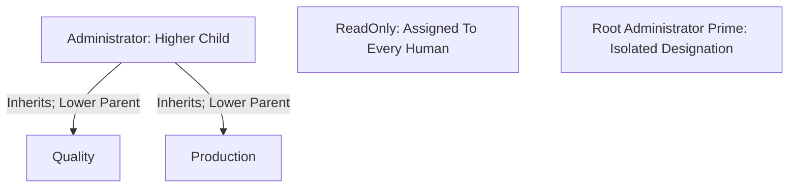

# ConfastDB: Phase 2 Authorization Architecture and Design Specification

Design date and revision: October 9, 2026. **Design only: nothing in this document is implemented.** This revision incorporates the approved delegated-administration/chat requirements and the subsequent clarification allowing safe lower-role edits to inherited sources.

Primary evidence: [Phase 1 authorization audit](authorization-audit.md). Its 404 gate sites, 248 service entry points, 157 candidate permissions and F01–F17 findings remain the migration checklist. References below are relative to `src/Confast.Web/` unless stated otherwise. This specification describes the current working tree, including the existing uncommitted chat work; it does not modify that work.

## 1. Executive Summary

Retain ASP.NET Core Identity, PostgreSQL, existing user/role IDs, cookie authentication and circuit-aware current-user resolution. Add relational permission grants and a small multi-parent role graph. One database-backed evaluator supplies both trusted service enforcement and ASP.NET Core policies. Cookies identify the caller; they do not establish current permission grants.

Assign the existing ReadOnly role permanently to every Identity user, including Administrator, Root and the Development browser-test account. ReadOnly is a protected baseline with no business write or sensitive workflow grants. Quality and Production remain independent. Administrator inherits Quality and Production and receives an explicit initial set of additional business/configuration/user-management grants. Administrator has no wildcard and never receives protected Root authority.

Use **both** an immutable Root system role and a singleton protected Root account designation. Exactly one active human account is designated Root in a ready installation. The designation, not a role claim, confers all recognized catalog permissions, including protected security authority. Root cannot participate in inheritance or ordinary role assignment. Its full permission coverage does not waive business validity, ownership, or private chat membership.

The reviewed catalog contains **164 keys: 106 resource permissions and 58 actions**. Ordinary roles may receive **163** of them; only `Authorization.ManageSecurity` is Root-only. Role creation/deletion, metadata, grants and inheritance are configurable ordinary capabilities. Remove `Roles.ManageDelegation` and its assignment flag. Rename the previous chat-read key to `Chat.Access`, split category creation from management, rename channel ordering to `Chat.ReorderChannels`, and add the explicitly requested new `Chat.DeleteOthersMessages` workflow. Every key and initial effective grant is enumerated in sections 5–6.

Recommended effective seed counts are ReadOnly **16**, Quality **85**, Production **77**, Administrator **163**, and Root **164**. These counts include mandatory ReadOnly membership. ReadOnly contains only the approved business-read floor and gives **no chat access**. Quality/Production receive explicit ordinary chat grants; Administrator additionally receives channel administration, moderation and every ordinary authorization-administration key. New users start with ReadOnly alone; no extra role is seeded.

Inheritance also establishes seniority: a child is higher than the parents whose grants it inherits. Users.ManageRoles permits another user's **peer or lower** assignment only through an actual directly assigned role relationship and a current grant-subset check. Grant/parent/deletion edits require a **strictly lower** target. The approved clarification permits editing such inherited sources, while final-state validation forbids any increase in the actor's permissions or management reach over existing roles. Directly held roles, higher/peer/unrelated roles, Root and baseline protections remain guarded.

Evaluate once per logical application operation and carry a server-created purpose-bound context through internal calls. Use a simple bounded in-process computed-data cache with an authoritative account/global-epoch check at each new operation; security edits evaluate under the serialized state lock. Subsequent operations observe committed revocations without logout. Refresh UI on navigation, relevant interactions, local edits and denials; no five-second circuit polling or retroactive cancellation is required.

Root selection/recovery custody, detailed business seed choices, moderation scope/retention and inspector migration inputs still need approval. This revision changes only this specification.

## 2. Confirmed Product Requirements

### Requirements explicitly supplied in Phase 2 and its revision

| ID | Requirement | Design consequence |
|---|---|---|
| R01 | Configurable roles, multiple direct assignments, multiple additive parents, no Deny | Union semantics; ordinary roles are identified by ID, not name. |
| R02 | Code-controlled permission catalog | Administrators, including Root, cannot invent permission strings. Catalog additions require a reviewed code/schema deployment. |
| R03 | Every new user gets ReadOnly; existing role-less users migrated; no role-less users | Permanent baseline membership is recommended, with database enforcement and transactional provisioning. |
| R04 | ReadOnly provides genuine ordinary-business read-only access | Explicitly close F01/F04 writable paths; ReadOnly never inherits business-write grants. |
| R05 | One protected Root Administrator Prime, separate from Administrator | Protected account designation plus system role, excluded from assignment and inheritance. |
| R06 | Root all application permissions without maintaining hundreds of rows | Special recognized-catalog evaluation for designated Root; no stored wildcard or automatic Administrator wildcard. |
| R07 | Root does not override privacy or business validity | All contextual checks execute after permission evaluation, including for Root. |
| R08 | Configurable ordinary role administration; peer/lower assignment and strictly-lower editing | Six ordinary Roles keys plus Users.ManageRoles; actual direct-role graph position AND grant envelope, with transactional final-state checks. No delegation flag. |
| R09 | Inspector eligibility is effective Inspections.Create, including inherited grants, Active users only | Remove Quality-name eligibility from lists and trusted create paths; preserve historical attribution. |
| R10 | Changes affect the next protected operation | Live database version/Active checks, consistent snapshot, no cookie-only or TTL-only authorization. |
| R11 | No new configurable record ACLs; preserve ownership/membership/workflow rules | Keep existing contextual rules as code, separate from configurable application grants. |
| R12 | Design revision only | Update this document in place; no source, policies, migrations, data changes, moderation or UI implementation. |
| R13 | Chat access is optional; granular creation, ordering, category and moderation controls | Chat.Access is absent from ReadOnly; other chat actions require it; moderation does not establish membership. |
| R14 | One evaluation per logical operation; modest UI freshness | Purpose-bound internal context, epoch-checked cache; no compulsory circuit polling or logout for grant edits. |
| R15 | Approved clarification: allow safe lower-role edits to inherited sources | Replaces the blanket inherited-source ban, which would forbid every lower-role edit. Require actor effective-set nonincrease and no new reachability over existing roles for each directly assigned anchor. |

### Recommendations introduced by this specification

Permanent ReadOnly membership and its protected 16-key envelope, one Root-only catalog entry, serialized delegation checks, a single global epoch, statically registered policies, purpose-bound operation cores, a stable inspector ID/history snapshot and offline Root recovery remain the design. Conservative role deletion, initial role-creation attachment and enable-state handling below are explicit recommendations, not present functionality. No separate delegation configuration is retained.

Universal capabilities are **authenticated Active human identity**, logout/session handling, self profile picture/status/presence/preferences, limited active-user directory presentation, own effective-access explanation, and self departure from a group. They are not business CRUD grants. Authentication endpoints still have their existing anonymous or token-based boundaries. Navigation exposes only destinations whose relevant permission is available; there is no independent Navigation permission. A lookup used by an authorized workflow exposes only the fields that workflow needs, not unrestricted user/settings administration.

No live database account/role inventory, migration, authenticated browser run, build, SMTP send, or test execution occurred. The audit's potential exploit and concurrency findings remain potential until tested. Source inspection here additionally verifies inspector selection/caliper dependencies and the existing Identity/current-user integration points.

## 3. Role and Root Authority Model

### Ordinary and protected roles

| Role | Identity and editability | Initial structure |
|---|---|---|
| ReadOnly | Preserve ID `1b171cb9-9273-42fc-b790-ea934dbb12b9`; immutable system key, canonical name and enabled state; cannot delete or remove from any user | No parents. Root may edit direct grants only within the code-defined baseline envelope. |
| Quality | Preserve ID `9eb9ef78-7737-47a5-89fc-10513d3e9c1b`; ordinary configurable role | No parents; direct quality and shared logistics/chat extras. |
| Production | Preserve ID `56b3fc07-e152-42ca-b074-a823900c93b3`; ordinary configurable role | No parents; direct planning/tracking and shared logistics/chat extras. |
| Administrator | Preserve ID `47cd3d4a-0d66-4acf-8556-4017336798d8`; ordinary configurable role | Parents Quality and Production; additional explicit grants complete the initial ordinary catalog. |
| Root Administrator Prime | New deployment-stable role ID and immutable system key `RootAdministratorPrime`; immutable canonical name, kind and enabled state | No parents, no children, no permission rows; one membership matching the singleton Root designation. |

All Identity users in this phase are human accounts. Renderer principals and workers are not Identity users and do not receive ReadOnly. Inactive humans retain baseline membership but have no operational permissions. Disabled ordinary roles retain assignments, stored grants and graph relationships, but contribute no operational grants through the disabled branch. Only enabled direct ordinary roles establish an ordinary actor's management anchors. Disabling/re-enabling is a security mutation requiring Roles.Update **and** Roles.ManagePermissions plus the same strictly-lower/final-state checks; metadata permission alone cannot activate dormant grants. ReadOnly and Root cannot be disabled.

Do not add redundant Quality → ReadOnly or Production → ReadOnly edges: their users already hold ReadOnly directly. The only initial edges are Administrator → Quality and Administrator → Production. An arrow means **higher child inherits lower parent**; database fields remain ChildRoleId and ParentRoleId. Multiple parents are supported. Root and eligible ordinary editors may change the graph subject to the rules below. ReadOnly is a protected automatic source, never an ordinary management anchor/target.

Illustrative only: Administrator → Quality Lead → Quality Inspector makes Lead lower than Administrator and Inspector lower than Lead. Do not seed those illustrative roles. Equal or overlapping effective sets create no hierarchy relationship; a union of unrelated direct roles creates no new edge or seniority.

Permanent baseline membership is preferable to fallback: it survives role deletion/revocation atomically, gives users predictable read access, and removes a zero-role race. Its cost is an intentional minimum access floor: an individual cannot be granted less than the current ReadOnly baseline while remaining an Active human. Reduce that floor globally through Root-controlled baseline edits or deactivate the account; there is no per-user Deny. If restricted external/guest identities are required later, that is a separate product change.

The initial code-defined baseline envelope is exactly the **16 business-read keys** in section 6. It excludes Chat.Access, all create/update/delete and action grants, administrative/full settings-editor reads and Root-only authority. ReadOnly has no parents and ordinary administrators cannot edit it. Root may remove optional baseline grants but cannot add chat/writes or enlarge the envelope without a reviewed catalog change. The manifest is explicit rather than “all keys ending in Read.”

### Protected Root identity and authority

`authorization_state.RootUserId` is the sole Root designation. Recognized Root requires an authenticated human principal whose resolved ID matches that row, a currently Active existing Identity account, valid session/security-stamp state, and a ready authorization installation. A display name, role name, role claim, permission row or caller-supplied user ID cannot establish Root authority. The matching Root role membership is an integrity invariant and UI badge, not a second source of independent authority.

The evaluator gives designated Root every **recognized** catalog key. Unknown keys fail even for Root. Ordinary roles can hold the 163 grantable entries, including role administration, but never Authorization.ManageSecurity. A complete ordinary union is not Root-equivalent: designation/protected-account authority remains nondelegable, and ordinary hierarchy/grant-envelope limits still apply. Cloning Root, changing system identity, granting protected authority, assigning Root or adding a Root edge is rejected through services and structural database invariants. Root may manage all ordinary roles, including Administrator; it still obeys baseline, history, ownership and privacy constraints.

Ordinary user administration cannot mutate any protected Root account setting: password/reset-token issuance, email/username/security identity, Active/lockout flags, roles, recovery/MFA material or administrative profile fields. Root is listed with a Protected badge and a redacted account-management view. Root uses its own protected security workflow for legitimate self changes, with recent authentication recommended. Universal self-picture/presence controls remain self-only and do not change security identity. No Root account transfer, deactivation or deletion is a normal application operation, including for Root itself.

The standard authentication rate/lockout protections still matter. A hostile actor can attempt login denial of service; account-management authorization cannot promise that Root is always available. Ordinary administration cannot set Root lockout or remove recovery, while a temporary authentication lockout preserves the designation and can be cleared through controlled recovery. Recommend stronger Root authentication and tested recovery custody; adding MFA to the current password-only workflow requires explicit scope approval (Q04).

### Role hierarchy and delegated administration

Use two separate calculations from the same trusted snapshot:

- `E(U)`: actor's current operational effective permissions, considering enabled roles/branches only.
- `M(r)`: role's management grant envelope, the union of its stored ordinary grants and all reachable stored parents **ignoring disabled state**. `M(U)` unions every assigned ordinary role's envelope even when the target account is inactive. This is dormant-authority protection, not usable permission or a record ACL.

Let `H(U)` contain **all** directly assigned Ordinary roles, including disabled ones, excluding ReadOnly/Root; `A(U)` is its enabled subset providing current management anchors. `Lower(a)` contains roles reached by one or more Child → Parent edges, even through disabled intermediates. T is an assignable **peer** only when T itself belongs to A(U), or **lower** through at least one A(U) path. Role IDs/actual paths establish position, not names/equivalent sets. Any role in H(U), including a disabled directly held role reached through another anchor, is locked against the actor's ordinary edits. A disabled direct assignment alone supplies no management anchor.

The actor must be authenticated, Active and session-valid, have the exact required administrative key and Roles.Read/Users.Read prerequisites, and pass both hierarchy and envelope checks. The permission may come from any of the actor's roles; the management position must come from one actual direct-role path. Combining permissions across unrelated assignments never manufactures a path.

### Peer and lower user-role assignment

Users.ManageRoles permits additions/removals on **another** ordinary human when each changed role is peer-or-lower AND `M(changed role) ⊆ E(actor)`. Added roles must be enabled. ReadOnly stays permanently checked; Root cannot be added/removed. Disabled-role removal still requires its full stored envelope, so it cannot be used to redistribute dormant powers. Reject an unauthorized changed role rather than silently strip it from a replacement checklist; unchanged assignments remain unchanged. Root can manage any ordinary target/role but cannot remove baseline or publicly assign Root.

| Direct Acting Role | Changed Role | Outcome With ManageRoles And Subset |
|---|---|---|
| Administrator | Administrator | Allow: same direct role; no hardcoded Administrator exception. |
| Administrator | Quality Lead | Allow only when that actual lower relationship exists. |
| Quality Lead | Quality Inspector | Allow with the actual inheritance path. |
| Quality Lead | Administrator | Deny: higher. |
| Quality Inspector | Quality Lead | Deny: higher. |
| Quality Lead | Unrelated Production Role | Deny even if all grants overlap; a valid actual lower path is required. |
| Two unrelated directly assigned roles | A role outside both paths | Deny; their combined permission set is insufficient. |

Users.Create initially provisions ReadOnly alone. Extra initial roles require ManageRoles and the same checks, never a default extra role or creation bypass. Password-setup/reset issuance separately requires Users.ResetPasswords. Users.Update does not imply grants, passwords or role assignment.

For credential/reset/email/security-identity/activation/deletion changes, additionally require `M(target user) ⊆ E(actor)` and recommend that **each** of the target's assigned ordinary roles be peer-or-lower to a current direct anchor. An inactive account or disabled role is not lower authority merely because operational grants are empty. Unrelated equal-permission accounts are not hierarchically manageable. Ordinary self role/activation/administrative-security edits remain denied; dedicated self profile/security paths are separate. This blocks lower-account takeover through reset/reactivation; Root targets always use protected self/recovery paths.

Password-reset links carry stored trusted issuer/target, issuer stamp snapshot, expiry and token digest. Anonymous redemption validates the normal Identity token **and** rechecks current issuer Active/stamp/ResetPasswords and the target's current hierarchy/envelope under the serialized lock, then atomically consumes the delegation. No request-supplied issuer or Root target, raw-token history, or surviving legacy unaudited link. A target upgrade or issuer revocation makes a prior link unusable. No algorithm can prove who already knows a password; future privileged upgrades must review credential/setup state.

### Strictly-lower grant editing and the approved conflict resolution

The revision initially banned editing inherited permission sources while defining lower roles through inheritance. Those requirements conflict: every lower role is an inherited ancestor. **The user's subsequent clarification takes precedence:** allow lower-source edits with final-state checks preventing any increase in the actor's permissions or management authority. Do not silently keep the blanket ban. Safe inherited-parent edits may therefore be allowed; edits to directly held roles, peers, higher/unrelated roles and protected system roles remain denied regardless of another administrative assignment.

An ordinary Roles.ManagePermissions operation requires T strictly lower to a current direct anchor and `T ∉ H(U)`. Every **added direct key** must be grantable and in the actor's pre-edit E(U). Removing a direct key does not require possession of that key. Validate the whole proposed result: `M_after(T) ⊆ E_before(U)`, no protected grant, and `E_after(U) ⊆ E_before(U)`. For every affected descendant, newly acquired stored/operational grants must be within E_before(U); do not require deleting unrelated pre-existing descendant grants merely because another parent supplied them. Validate all descendants, including inactive assignees/disabled branches, rather than just the edited checkbox.

Removal of an unavailable grant is useful where disabled branches preserve stored authority. It is allowed only if the batch's **final** envelope is within E_before(U). Remove all remaining out-of-envelope direct grants together; if an inherited unavailable grant remains, direct-only removal cannot satisfy the final-state check and must be denied or escalated to Root. No “remove” exception authorizes adding it back. Losing one's own permission through a safe lower-source removal is possible; the next operation must use the reduced set, with no sticky editor authority.

### Role creation, metadata, deletion and inheritance

| Operation | Ordinary Actor's Permitted Scope / Final-State Rule |
|---|---|
| Roles.Read | View ordinary roles/graph/provenance; user-account detail also requires Users.Read. Viewing is not management eligibility. |
| Roles.Create | Select one enabled direct Ordinary anchor; create an Ordinary role with empty grants/parents and atomically add **anchor → new role**. This narrowly prescribed attachment is part of Create, not a general permission to edit the anchor. The new role is subordinate; never auto-assign it to creator or copy another role's grants/parents. |
| Roles.Update | Rename/describe strictly lower ordinary roles; no system identity or security fields. Enable-state changes additionally require ManagePermissions and full envelope/actor/scope checks. |
| Roles.Delete | Strictly lower ordinary role; protected roles forbidden. Conservative first implementation: deny while any user assignment remains; reassignment/removal is a separate ManageRoles operation. Preview all descendant/edge effects, then explicitly remove incident edges/direct grants and the role atomically, with **no reparenting**. This only removes contributions/relationships; validate actor/descendant final state. Root follows the same assignment-safety/dependency workflow. |
| Roles.ManagePermissions | Strictly lower target, additions possessed currently, final envelope and own-authority checks above. |
| Roles.ManageInheritance | Strictly lower target; edit its outgoing parent set. Added parent must itself be strictly lower to an existing direct actor anchor, not a directly held/system role, and its M envelope must be within E_before(U). Validate all proposed edges and affected descendants; no new actor seniority through an unrelated role. |

Creation has an explicit, limited exception to reachability nonincrease: it adds management of **one fresh empty subordinate ID**, which is exactly the authorized Create purpose. It cannot create a new relationship among existing roles, alter the anchor's grants/parents, import authority or place the creator under the new role. Subsequent edits obtain fresh authorization and ordinary lower-role/envelope checks; creation history is attribution, not a permanent creator ACL.

For any ordinary graph/grant/enable/delete mutation, compare **every pre-existing role in H(U) separately**, including disabled direct roles: `Lower_after(a) ⊆ Lower_before(a)` over existing role IDs. A union-level test is insufficient: linking Quality to separately held Production could leave the union unchanged while giving Quality a new management path. Disabled direct roles must not acquire dormant future management reach either. Apart from the fresh-ID Create exception, ordinary editors cannot add their own reachability or change direct assignments. Reject higher/unrelated-to-manageable transformations, roles placed above an actor anchor, acquired actor grants or protected-identity bypasses. Root may deliberately restructure ordinary hierarchy while remaining isolated.

The entire proposed graph must remain acyclic and maintain ReadOnly/Root protections. The target's final dormant envelope, actor's operational nonincrease, per-anchor reachability nonincrease and new grants on every affected descendant are checked together. Existing descendant roles may have additional legitimate grants from unrelated parents; retain those but deny newly propagated unauthorized authority. Metadata changes use lower eligibility; enable changes use the stronger security protocol and cannot restore hidden greater grants. No per-role assignment/delegation flag or Roles.ManageDelegation remains.

Authorize once **after** taking the security-state lock, against reloaded actor/direct roles/target/graph, and derive all current/result comparisons from that snapshot. Reject stale epoch/concurrency stamps. All mutations and history commit together; a multi-edit batch validates its final graph, and separate edits each use the previous committed result. Previously valid authority cannot be carried to a second edit after revocation. Section 8 specifies the transactional/database boundary.

### Root recovery and readiness

Exactly one designation is a structural guarantee, not proof that somebody can sign in. Before cutover, require a real initialized password, any approved authentication setup, a verified normal Root login, and a tested operator recovery procedure. This addresses F17 rather than replacing “last active administrator” with another misleading count. Once ready, the designated Root cannot be deactivated/deleted. Ordinary Administrator survival is no longer the recovery invariant; deleting that ordinary role cannot delete system ownership.

Recommended recovery is an **offline, separately privileged operator tool**, not a public endpoint, startup configuration or magic system flag:

1. Put every app instance into maintenance/offline mode; take a secure database and Data Protection/recovery-material backup. Verify the intended environment and current designated Root ID.
2. Use restricted host/database maintenance credentials, an explicit recovery purpose/reason, expected Root ID and expected state revision. Normal application database credentials cannot replace the Root designation or protected system-role identities.
3. Prefer repairing the same account: initialize/reset its password using Identity's supported password mechanisms, restore approved authentication/recovery material, clear an accidental lockout, and rotate security stamps. Do not print passwords/tokens in logs or keep an always-valid bypass credential.
4. If the account is irreparably lost, an exceptional replacement requires an explicitly named existing/created human target, operator confirmation of the old designation, and one transaction moving the designation and sole Root membership. The old account becomes ordinary; there is never a committed second Root. This is recovery, not a general role-assignment feature.
5. Validate the graph, catalog, baseline membership and exactly-one-Root invariants. Rotate the installation generation after backup restoration; invalidate restored human sessions/security stamps, restart instances and discard old caches. A restored epoch number must not accidentally match an old cached set.
6. Confirm normal authentication as the repaired Root before reopening. Record operator identity, environment, old/new IDs, reason and state revision without secret material. Remove temporary artifacts and test recovery custody periodically.

Restore a consistent backup rather than inventing Root from the first Administrator when designation/catalog data is corrupt. Missing/duplicate/mismatched Root state fails protected operations closed and keeps the installation in maintenance. Provisioning and recovery never run automatically at ordinary startup. Lost Root password recovery is out of band; ordinary administrators cannot issue Root reset links. The existing anonymous password-reset flow must reject Root account redemption unless an explicitly designed, narrowly scoped Root setup mechanism is approved. No such mechanism is assumed here.

## 4. Effective Permission and Inheritance Semantics

For an Active ordinary user U, let D(U) be directly assigned enabled roles, Anc(r) the enabled parents reachable from r, and G(r) its direct grantable keys. Then:

`Effective(U) = union of G(r) for every r in D(U) and their reachable enabled parents.`

ReadOnly participates as an ordinary positive grant source with a protected baseline envelope. There is no Deny, subtraction, role precedence, “most privileged role” selector or implicit CRUD hierarchy. Multiple roles and diamond inheritance deduplicate keys. Disabling/removing a parent removes that contribution but does not remove identical grants supplied elsewhere. Root uses the separate recognized-catalog rule in section 3.

Load the small role/edge/grant graph with projected EF queries in one consistent authorization snapshot. Traverse parents using a visited set and recursion-stack cycle detection; memoize a role's closure inside the calculation. Complexity is linear in graph edges/roles plus grant-set unions; a closure table or distributed graph engine is unnecessary at ConfastDB's current scale. Preserve direct-grant IDs and supplying-role IDs for provenance; compute display paths on demand rather than enumerate exponentially many diamond paths.

Adding Child → Parent is invalid if Child = Parent, either side is Root, Child is ReadOnly, the edge already exists, or Parent can already reach Child. Validate the final graph, including bulk edits, while holding the common security-edit lock. A second transaction waits and rechecks the first transaction's committed result. Application validation supplies useful errors; a database trigger supplies the integrity backstop. Any cycle encountered during evaluation denies the affected operation and alerts operators rather than truncating traversal into an invented grant set.

### Prerequisites and dependent reads

Effective-set calculation does not automatically add prerequisites. At an operation boundary, explicitly require all keys listed for that operation. The editor shows missing prerequisites and can offer to add their **direct grants** with review; an inherited prerequisite is already sufficient. Unchecking a prerequisite does not secretly delete other grants, but the impact preview shows affected operations.

Use the corresponding resource Read key with a write/action where it exists, with **Inspections.Create as an explicit exception**: the brief requires that permission to be sufficient for ordinary inspection initiation/creation. A Create-only qualified user can access minimal creation reference/candidate data and create a valid new inspection, but cannot thereby browse existing inspection history or modify measurements. A special workflow action authorizes its defined aggregate changes; it does not automatically require every generic CRUD key on intermediate records. The exceptions/dependencies in section 5 are authoritative. Package/template, receiving/inspection, schedule/lookup and inspector-name internals consume only necessary fields under an already-authorized operation, without granting full settings/user management.

### Inspector eligibility and attribution

An eligible candidate is an existing Active human with current effective `Inspections.Create`; this includes inherited/multi-role grants and designated Root. It does not require Quality by name or Inspections.Read and does not imply Update, deviation, receiving, undo or delete. Ordinary creation requires Create plus Active/valid input, while receipt-based creation additionally requires the specified Receiving permissions. Batch-load Active users and assignments against the same current graph/epoch; calculate candidate sets without one query per user. Do not authorize general user-administration projections just to populate a selector.

Verified dependencies to replace:

| Current source | Required design change |
|---|---|
| `Features/Identity/UserAdministrationService.cs:116-124` | Replace Quality-name list, currently lacking Active filtering, with permission-derived minimal candidate records. |
| `Components/Pages/Inspections/Create.razor:182-188` | Creation candidates are all qualified users; default to current user only if qualified. |
| `Components/Pages/Inspections/Edit.razor:1874`, selector `:571-572` | Reuse qualification list; keep historical/current stored inspector visible even after eligibility loss. Validate only a newly selected attribution, not an unchanged historical value. |
| `Features/Inspections/InspectionService.cs:373,378,460,847-868,1663` | Guard actual creation, receiving's internal create path and changed inspector selection. Caliper lookup currently resolves ambiguous display names; stable identity is recommended. |
| `Features/ContainerTracking/ReceivedPartsService.cs:452-460`, ReceivedParts page `:2`, MainLayout `:21` | Replace A/Q operation gates with exact Receiving keys; begin also requires Inspections.Create, while bump/reverse remain distinct. |
| `IdentityBootstrapper.cs:37`; `TrackingAccess.cs:23` | Role-name provisioning may remain a deployment seed label; tracking authorization becomes keys, not inspector qualification. |
| `tests/Confast.Web.Tests/IdentityTests.cs:104` and inspector workflow tests | Replace Quality-list expectations with Active/effective-create eligibility, multi-parent and revocation tests. |

Creation dropdowns display **all users with Inspections.Create**, not only candidates who may themselves allocate a received container. The actor performing receiving needs the receiving action; an attributed inspector does not acquire that action by being selected. Bump/reversal actor eligibility is checked separately, and no new inspector dropdown is invented for those actions. Historical/search filters may show past inspector labels without treating them as newly eligible candidates.

`Inspection.Inspector` is currently a name string (`Inspection.cs:30`), not a user FK; caliper lookup matches DisplayName and takes the first username match. Retain the proposed stable model: nullable InspectorUserId for legacy records plus existing historical name snapshot; new selections submit ID/display label and validate Active/effective Create. Disambiguate duplicate names and resolve caliper by ID. Existing names remain untouched; only unambiguous reviewed mappings may be backfilled (Q06). Historical unchanged attribution remains saveable after qualification loss. Attribution edits need Update and fresh candidate validation within the same authorized save operation. Stable-ID enforcement cannot be claimed while selection still depends on ambiguous strings.

## 5. Final Proposed Permission Catalog

This numbered **proposal** accounts for all 157 Phase 1 entries. Numbers are documentation references; stable keys identify code/database permissions. Existing gates use audit abbreviations A, Q, P, Auth and Active. Keep means an existing operation warrants a boundary, not preservation of broad Auth access. Revised/Split/Rename marks the approved redesign; New marks a requested unimplemented operation. Only Authorization.ManageSecurity is protected and unavailable for ordinary grants.

Code definitions, including authority class, prerequisites and baseline eligibility, remain authoritative over persisted display metadata. Derive CatalogVersion from a deterministic fingerprint of the semantic definitions; verify the stored manifest against it before ready startup. Neither an ordinary administrator nor the Root editor can change that fingerprint or definition flags. Runtime recognizes only the compiled keys/classes; database metadata cannot reclassify a protected key as grantable.

Profiles.Read and Profiles.UpdateSelf remain universal Active-human presentation/self-service with self, target-Active, Invisible and session-ownership checks; arbitrary account details are not public. Profile HTTP routes retain cookie/Active checks and never accept the print scheme. No unsupported customer/gage/log deletion, certification replacement or inspection reopen is invented. **Message moderation is explicitly new requested functionality**, not an audited existing operation. Criteria child edits and container contents remain aggregate boundaries.

Catalog reconciliation: 157 audit candidates − 2 universal profile entries + 7 retained control-plane entries + 1 category-creation split + 1 new moderation entry = **164**. Historical keys `Chat.Read` → `Chat.Access`, `Chat.ManageFolders` → `Chat.ManageCategories`, and `Chat.ArrangeChannels` → `Chat.ReorderChannels` are one-for-one renames, with category creation additionally split out. Compared with the previous 163-key design, remove Roles.ManageDelegation and add the two chat keys. Four previously Root-only role-management keys become ordinary grants; the delegation key is removed and Authorization.ManageSecurity remains protected. No delegation-configuration replacement is proposed.

For each retained entry the table states operation/current gate and review/prerequisites. The row's own key is always required; the final column lists additional prerequisites or contextual qualifications. Settings-read keys cover full editors; narrow dependent projections do not require them. Resource/action classification is retained except the removed profile keys; scoped chat operations remain actions because they compose with ownership/membership. New role CRUD entries apply only to the requested control plane, not fabricated business functionality.

| # | Permission Key / Display Name | Category / Classification | Confirmed Operation / Current Restriction | Review / Additional Required Keys |
|---|---|---|---|---|
| P001 | `Users.Read` — Read Users | Users / Resource | UserAdministrationService.GetUsersAsync:93 / GetUserForEditAsync:126; full account/role editor projections; **Current:** A page; no caller guard | Keep: meaningful resource/document/editor read; bounded dependent lookup does not grant full administration. Required: Active human; designated Root additionally for protected authority. |
| P002 | `Users.Create` — Create Users | Users / Resource | CreateUserAsync:158; new accounts, including public-channel enrollment; **Current:** A page; no caller guard | Keep: supported Create boundary; do not manufacture absent CRUD counterparts. Required: `Users.Read`. |
| P003 | `Users.Update` — Update Users | Users / Resource | UpdateUserAsync:202; identity/profile/activation/caliper changes; **Current:** A page; no caller guard | Keep: ordinary metadata/activation only; role/reset changes separately authorized; Root/target delegation protections. Required: `Users.Read`. |
| P004 | `Users.Delete` — Delete Users | Users / Resource | DeleteUserAsync:286; current self/reference/last-active-A checks; **Current:** A page; no caller privilege guard | Keep: trusted actor, self/reference and target-authority protections; replace sequential final-A count with protected initialized Root invariant. Required: `Users.Read`. |
| P005 | `Users.ManageRoles` — Assign User Roles | Users / Action | CreateUserAsync:188 and UpdateUserAsync:246-266; direct assignments; **Current:** A page; no caller guard | Keep: assign/remove another user's peer or lower ordinary roles through an actual enabled direct-role anchor AND stored-envelope subset; no self/Root/baseline removal. Required: `Users.Read`. |
| P006 | `Users.ResetPasswords` — Issue Password Reset Links | Users / Action | GeneratePasswordResetTokenAsync:277; token generation from Users page; **Current:** A page; no caller guard | Keep: credential takeover boundary; cannot reset Root or a higher-privilege target. Required: `Users.Read`. |
| P007 | `Customers.Read` — Read Customers | Customers / Resource | CustomerService.GetCustomersAsync:24 / GetCustomerAsync:31; **Current:** Auth UI; no service guard | Keep: meaningful resource/document/editor read; bounded dependent lookup does not grant full administration. Required: Active human; designated Root additionally for protected authority. |
| P008 | `Customers.Create` — Create Customers | Customers / Resource | CustomerService.CreateCustomerAsync:9; **Current:** Auth UI; no service guard | Keep: supported Create boundary; do not manufacture absent CRUD counterparts. Required: `Customers.Read`. |
| P009 | `Customers.Update` — Update Customers | Customers / Resource | CustomerService.SaveCustomerAsync:38; includes activation; **Current:** Auth UI; no service guard | Keep: supported Update boundary; do not manufacture absent CRUD counterparts. Required: `Customers.Read`. |
| P010 | `Plants.Read` — Read Customer Plants | Plants / Resource | CustomerService.GetPlantsAsync:51; **Current:** Auth UI; no service guard | Keep: meaningful resource/document/editor read; bounded dependent lookup does not grant full administration. Required: Active human; designated Root additionally for protected authority. |
| P011 | `Plants.Create` — Create Customer Plants | Plants / Resource | CustomerService.SavePlantAsync:63 when Id == 0; **Current:** Auth UI; no service guard | Keep: supported Create boundary; do not manufacture absent CRUD counterparts. Required: `Plants.Read`. |
| P012 | `Plants.Update` — Update Customer Plants | Plants / Resource | CustomerService.SavePlantAsync:63 existing plant; **Current:** Auth UI; no service guard | Keep: supported Update boundary; do not manufacture absent CRUD counterparts. Required: `Plants.Read`. |
| P013 | `Plants.Delete` — Delete Customer Plants | Plants / Resource | CustomerService.DeletePlantAsync:95; **Current:** Auth UI; no service guard | Keep: supported Delete boundary; do not manufacture absent CRUD counterparts. Required: `Plants.Read`. |
| P014 | `PlantCertificationRecipients.Read` — Read Plant Certification Recipients | Plant Certification Delivery / Resource | GetPlantCertificationDeliveryAsync:113; To/Cc contact records; **Current:** Auth UI; no service guard | Keep: meaningful resource/document/editor read; bounded dependent lookup does not grant full administration. Required: Active human; designated Root additionally for protected authority. |
| P015 | `PlantCertificationRecipients.Create` — Create Plant Certification Recipients | Plant Certification Delivery / Resource | SavePlantCertificationRecipientAsync:136 new recipient; **Current:** Auth UI; no service guard | Keep: supported Create boundary; do not manufacture absent CRUD counterparts. Required: `PlantCertificationRecipients.Read`. |
| P016 | `PlantCertificationRecipients.Update` — Update Plant Certification Recipients | Plant Certification Delivery / Resource | SavePlantCertificationRecipientAsync:136 existing recipient; **Current:** Auth UI; no service guard | Keep: supported Update boundary; do not manufacture absent CRUD counterparts. Required: `PlantCertificationRecipients.Read`. |
| P017 | `PlantCertificationRecipients.Delete` — Delete Plant Certification Recipients | Plant Certification Delivery / Resource | DeletePlantCertificationRecipientAsync:157; **Current:** Auth UI; no service guard | Keep: supported Delete boundary; do not manufacture absent CRUD counterparts. Required: `PlantCertificationRecipients.Read`. |
| P018 | `PlantCertificationSettings.Read` — Read Plant Certification Settings | Plant Certification Delivery / Resource | GetPlantCertificationDeliveryAsync:113; requirement and filename settings; **Current:** Auth UI; no service guard | Keep: meaningful resource/document/editor read; bounded dependent lookup does not grant full administration. Required: Active human; designated Root additionally for protected authority. |
| P019 | `PlantCertificationSettings.Update` — Update Plant Certification Settings | Plant Certification Delivery / Resource | SavePlantCertificationConfigurationAsync:167; requirements and package filename templates; **Current:** Auth UI; no service guard | Keep: supported Update boundary; do not manufacture absent CRUD counterparts. Required: `PlantCertificationSettings.Read`. |
| P020 | `Parts.Read` — Read Parts | Parts / Resource | PartService.GetPartsAsync:12 / GetPartsForCustomerAsync:24 / GetPartAsync:72 / GetPartForDeleteAsync:109; choices and eligibility hint; **Current:** Auth UI; no service guard | Keep: meaningful resource/document/editor read; bounded dependent lookup does not grant full administration. Required: Active human; designated Root additionally for protected authority. |
| P021 | `Parts.Create` — Create Parts | Parts / Resource | PartService.CreatePartAsync:126; customer/plant assignments; **Current:** Auth UI; no service guard | Keep: supported Create boundary; do not manufacture absent CRUD counterparts. Required: `Parts.Read`. |
| P022 | `Parts.Update` — Update Parts | Parts / Resource | PartService.SavePartAsync:193; metadata/plant assignments; **Current:** Auth UI; no service guard | Keep: supported Update boundary; do not manufacture absent CRUD counterparts. Required: `Parts.Read`. |
| P023 | `Parts.Delete` — Delete Parts | Parts / Resource | PartService.DeletePartAsync:277; **Current:** Auth UI; no service guard | Keep: supported Delete boundary; do not manufacture absent CRUD counterparts. Required: `Parts.Read`. |
| P024 | `PartFlipDefinitions.Read` — Read Part Flip Configuration | Part Flip Definitions / Resource | PartFlipService.GetConfigurationAsync:11 / GetCurrentCriterionOptionsAsync:34; full editor; execution preview is covered by Inspections.Flip; **Current:** A configuration page; Auth execution reads; no service guard | Keep: full configuration differs from the narrow preview under Inspections.Flip. Required: Active human; designated Root additionally for protected authority. |
| P025 | `PartFlipDefinitions.Create` — Create Part Flip Definitions | Part Flip Definitions / Resource | PartFlipService.SaveDefinitionAsync:40 new definition; **Current:** A configuration page; Auth execution reads; no service guard | Keep: supported Create boundary; do not manufacture absent CRUD counterparts. Required: `PartFlipDefinitions.Read`. |
| P026 | `PartFlipDefinitions.Update` — Update Part Flip Definitions | Part Flip Definitions / Resource | ReplaceMappingsAsync:79; replaces mappings on an existing definition; **Current:** A configuration page; Auth execution reads; no service guard | Keep: replaces mappings only; SaveDefinition creates and does not update existing definitions. Required: `PartFlipDefinitions.Read`. |
| P027 | `PartFlipDefinitions.Delete` — Delete Part Flip Definitions | Part Flip Definitions / Resource | DeleteDefinitionAsync:92; **Current:** A configuration page; Auth execution reads; no service guard | Keep: supported Delete boundary; do not manufacture absent CRUD counterparts. Required: `PartFlipDefinitions.Read`. |
| P028 | `Gages.Read` — Read Gages | Gages / Resource | GageService.GetGagesAsync:34; **Current:** Auth UI; no service guard | Keep: meaningful resource/document/editor read; bounded dependent lookup does not grant full administration. Required: Active human; designated Root additionally for protected authority. |
| P029 | `Gages.Create` — Create Gages | Gages / Resource | SaveGageAsync:86 new gage; **Current:** Auth UI; no service guard | Keep: supported Create boundary; do not manufacture absent CRUD counterparts. Required: `Gages.Read`. |
| P030 | `Gages.Update` — Update Gages | Gages / Resource | SaveGageAsync:86 existing gage; **Current:** Auth UI; no service guard | Keep: supported Update boundary; do not manufacture absent CRUD counterparts. Required: `Gages.Read`. |
| P031 | `GageTypes.Read` — Read Gage Types | Gages / Resource | GetGageTypesAsync:9 / GetGageTypeChoicesAsync:20; **Current:** Auth UI; no service guard | Keep: meaningful resource/document/editor read; bounded dependent lookup does not grant full administration. Required: Active human; designated Root additionally for protected authority. |
| P032 | `GageTypes.Create` — Create Gage Types | Gages / Resource | SaveGageTypeAsync:51 new type; **Current:** Auth UI; no service guard | Keep: supported Create boundary; do not manufacture absent CRUD counterparts. Required: `GageTypes.Read`. |
| P033 | `GageTypes.Update` — Update Gage Types | Gages / Resource | SaveGageTypeAsync:51 existing type; **Current:** Auth UI; no service guard | Keep: supported Update boundary; do not manufacture absent CRUD counterparts. Required: `GageTypes.Read`. |
| P034 | `InspectionCriteria.Read` — Read Inspection Criteria | Inspection Criteria / Resource | InspectionCriteriaService.GetPartSummaryAsync:87 / GetRevisionHistoryAsync:118 / GetRevisionAsync:132 / GetCriterionAsync:235; unit/process/certification lookups; **Current:** Auth UI/HTTP; no service guard | Keep: meaningful resource/document/editor read; bounded dependent lookup does not grant full administration. Required: Active human; designated Root additionally for protected authority. |
| P035 | `InspectionCriteria.Create` — Create Inspection Criteria Revisions | Inspection Criteria / Resource | CreateDraftRevisionAsync:265; initial/duplicate draft; **Current:** Auth UI/HTTP; no service guard | Keep: supported Create boundary; do not manufacture absent CRUD counterparts. Required: `InspectionCriteria.Read`. |
| P036 | `InspectionCriteria.Update` — Update Inspection Criteria Revisions | Inspection Criteria / Resource | SaveRevisionHeaderAsync:534; Add/Save/Delete/Move criteria :672/745/821/864/924/993; secondary-process requirements :1036/1092/1156; certification requirements :1199; **Current:** Auth UI/HTTP; no service guard | Keep: aggregate revision/criterion/process/certification edits; child CRUD keys would duplicate this boundary. Required: `InspectionCriteria.Read`. |
| P037 | `InspectionCriteria.Delete` — Delete Inspection Criteria Revisions | Inspection Criteria / Resource | DeleteRevisionAsync:481; **Current:** Auth UI/HTTP; no service guard | Keep: supported Delete boundary; do not manufacture absent CRUD counterparts. Required: `InspectionCriteria.Read`. |
| P038 | `InspectionCriteria.Publish` — Publish Inspection Criteria Revision | Inspection Criteria / Action | PublishRevisionAsync:404; **Current:** Auth UI; no service guard | Keep: distinct supported workflow/action; contextual validation stays independent. Required: `InspectionCriteria.Read`. |
| P039 | `MasterPrints.Read` — Read Master Prints | Inspection Criteria / Resource | InspectionCriteriaService.GetMasterPrintAsync:570; Program.cs:308; **Current:** Auth UI/HTTP; no service guard | Keep: meaningful resource/document/editor read; bounded dependent lookup does not grant full administration. Required: Active human; designated Root additionally for protected authority. |
| P040 | `MasterPrints.Update` — Upload or Replace Master Prints | Inspection Criteria / Resource | UploadMasterPrintAsync:590; one supported upload/replacement operation; **Current:** Auth UI/HTTP; no service guard | Keep: one upload/replacement operation; no separate unsupported Create slot. Required: `MasterPrints.Read`. |
| P041 | `MasterPrints.Delete` — Delete Master Prints | Inspection Criteria / Resource | DeleteMasterPrintAsync:636; **Current:** Auth UI/HTTP; no service guard | Keep: supported Delete boundary; do not manufacture absent CRUD counterparts. Required: `MasterPrints.Read`. |
| P042 | `Inspections.Read` — Read Inspections | Inspections / Resource | InspectionService.GetInspectionsAsync:48/52 / FindInspectionsAsync:60 / GetInspectionAsync:1069 / GetInspectionForDeleteAsync:355; narrow options; **Current:** Auth UI/HTTP; no service guard | Keep: meaningful resource/document/editor read; bounded dependent lookup does not grant full administration. Required: Active human; designated Root additionally for protected authority. |
| P043 | `Inspections.Create` — Create Inspections | Inspections / Resource | CreateInspectionAsync:373; receiving BeginInspection is a separate authorized workflow; **Current:** Auth UI/HTTP; no service guard | Keep: new-inspection authority AND inspector eligibility; sufficient for ordinary creation with bounded reference reads, no Inspections.Read prerequisite; never implies other inspection actions. Required: Active human (Create itself is sufficient). |
| P044 | `Inspections.Update` — Update Inspections | Inspections / Resource | SaveInspectionAsync:1553; observations, gage selections, notes, secondary-process state; **Current:** Auth UI/HTTP; no service guard | Keep: supported Update boundary; do not manufacture absent CRUD counterparts. Required: `Inspections.Read`. |
| P045 | `Inspections.Delete` — Delete Inspections | Inspections / Resource | DeleteInspectionAsync:1789; **Current:** Auth UI/HTTP; no service guard | Keep: supported Delete boundary; do not manufacture absent CRUD counterparts. Required: `Inspections.Read`. |
| P046 | `Inspections.Duplicate` — Duplicate Inspection Lots | Inspections / Action | DuplicateInspectionAsync:559; related-lot creation/quantity handling; **Current:** Auth UI; no service guard | Keep: lineage-producing creation; generic Create alone cannot authorize duplication. Required: `Inspections.Read`, `Inspections.Create`. |
| P047 | `Inspections.Flip` — Flip Inspection to Another Part | Inspections / Action | GetFlipPreviewAsync:721 / FlipInspectionAsync:755; configured destination and mapping; **Current:** Auth UI; no service guard | Keep: lineage and part conversion; configuration lookup is a bounded dependent read. Required: `Inspections.Read`, `Inspections.Create`. |
| P048 | `Inspections.TransferQuantity` — Transfer Additional Lot Quantity | Inspections / Action | MoveAdditionalLineageQuantityAsync:1005; **Current:** Auth UI; no service guard | Keep: quantity transfer workflow distinct from measurement editing. Required: `Inspections.Read`. |
| P049 | `Inspections.UndoLineage` — Undo Lot Lineage Operation | Inspections / Action | UndoLineageOperationAsync:873; duplicate/transfer/flip reversal; **Current:** Auth UI; no service guard | Keep: reversing lineage can remove generated records; action covers that bounded reversal, not arbitrary Delete. Required: `Inspections.Read`. |
| P050 | `Inspections.ApproveDeviation` — Change Deviation Approval | Inspections / Action | SaveInspectionAsync:1727; changing DeviationApproved; **Current:** Auth UI; no service guard | Keep: diff check for changing or clearing approval; ordinary Update alone is insufficient. Required: `Inspections.Read`, `Inspections.Update`. |
| P051 | `InspectionSheets.Export` — Export Inspection Sheets | Inspections / Action | Program.cs:405/438; print/download and inspection sheet merged with certifications; Print.razor printable page; **Current:** Auth UI; no service guard | Keep: standalone printable/downloadable export; merged certification bytes also need Certifications.Read. Required: `Inspections.Read`. |
| P052 | `Certifications.Read` — Read Certification Documents | Certifications / Resource | InspectionService.GetCertificationDocumentAsync:1425 / GetCertificationDocumentPreviewAsync:1460 / GetCertificationDocumentsForPdfAsync:1442; Program.cs:332/356/380; **Current:** Auth UI/HTTP; no service guard | Keep: meaningful resource/document/editor read; bounded dependent lookup does not grant full administration. Required: Active human; designated Root additionally for protected authority. |
| P053 | `Certifications.Create` — Upload Certification Documents | Certifications / Resource | UploadCertificationDocumentAsync:1349; append supported documents; **Current:** Auth UI/HTTP; no service guard | Keep: uploads append documents; no implemented generic replacement/Update slot. Required: `Certifications.Read`. |
| P054 | `Certifications.Delete` — Delete Certification Documents | Certifications / Resource | DeleteCertificationDocumentAsync:1524; **Current:** Auth UI/HTTP; no service guard | Keep: supported Delete boundary; do not manufacture absent CRUD counterparts. Required: `Certifications.Read`. |
| P055 | `Certifications.BuildPackage` — Build and Export Certification Packages | Certifications / Action | CertificationPackageService.BuildAsync:69; lot/plant selection, merge, generated-package download; **Current:** Auth UI; sender Active + email for send path | Keep: constrained merge/export; internal print/template reads do not require full configuration or separate sheet export. Required: `Inspections.Read`, `Certifications.Read`. |
| P056 | `Certifications.SendEmail` — Send Certification Package Email | Certifications / Action | Edit.razor:1763 -> CurrentEmailSender.GetAsync -> CertificationEmailService.SendAsync:16; **Current:** Auth UI; sender Active + email for send path | Keep: external delivery boundary, current sender identity/email validation; BuildPackage alone cannot send. Required: `Inspections.Read`, `Certifications.Read`, `Certifications.BuildPackage`. |
| P057 | `Certifications.TemporarilyCompletePackage` — Temporarily Complete Package Rendering | Certifications / Action | CertificationPackageRequest.TemporarilyCompleteIncompleteLots:27; BuildAsync token options :205; Print.razor:218; rendering only; **Current:** Auth UI; sender Active + email for send path | Keep: protected render option only; never persists completion. Required: `Inspections.Read`, `Certifications.Read`, `Certifications.BuildPackage`. |
| P058 | `CertificationEmailTemplates.Read` — Read Certification Email Templates | Email Administration / Resource | CertificationEmailTemplateService.GetAllAsync:82; full editor; **Current:** A editor page; authorized dependent send reads values | Keep: meaningful resource/document/editor read; bounded dependent lookup does not grant full administration. Required: Active human; designated Root additionally for protected authority. |
| P059 | `CertificationEmailTemplates.Update` — Update Certification Email Templates | Email Administration / Resource | SaveAsync:90; subject/body templates; **Current:** A editor page; authorized dependent send reads values | Keep: supported Update boundary; do not manufacture absent CRUD counterparts. Required: `CertificationEmailTemplates.Read`. |
| P060 | `CertificationEmailSettings.Read` — Read Global Certification Email Settings | Email Administration / Resource | GetSettingsAsync:108; full editor; dependent send consumes required CC internally; **Current:** A editor page; authorized dependent send reads values | Keep: meaningful resource/document/editor read; bounded dependent lookup does not grant full administration. Required: Active human; designated Root additionally for protected authority. |
| P061 | `CertificationEmailSettings.Update` — Update Global Certification Email Settings | Email Administration / Resource | SaveSettingsAsync:116; implicit global CC; **Current:** A editor page; authorized dependent send reads values | Keep: supported Update boundary; do not manufacture absent CRUD counterparts. Required: `CertificationEmailSettings.Read`. |
| P062 | `NominalToleranceSettings.Read` — Read Nominal Tolerance Settings | Global Settings / Resource | NominalToleranceSettingsService.GetAsync:33; settings editor; **Current:** A page; normal inspection services consume values | Keep: meaningful resource/document/editor read; bounded dependent lookup does not grant full administration. Required: Active human; designated Root additionally for protected authority. |
| P063 | `NominalToleranceSettings.Update` — Update Nominal Tolerance Settings | Global Settings / Resource | SaveAsync:48; **Current:** A page; normal inspection services consume values | Keep: supported Update boundary; do not manufacture absent CRUD counterparts. Required: `NominalToleranceSettings.Read`. |
| P064 | `Development.SetBusinessDate` — Set Development Business Date | Development / Action | MainLayout.razor:87/93 -> DevelopmentDateOverrideTimeProvider; global singleton override/reset; **Current:** Date: Development layout; SMTP: Development + A | Keep: real implemented utility; also requires Development environment, never baseline. Required: Active human; designated Root additionally for protected authority. |
| P065 | `Development.SendTestEmail` — Send Development SMTP Test | Development / Action | Program.cs:207-246; configured test recipient; **Current:** Date: Development layout; SMTP: Development + A | Keep: real implemented utility; also requires Development environment, never baseline. Required: Active human; designated Root additionally for protected authority. |
| P066 | `Suppliers.Read` — Read Suppliers | Suppliers / Resource | SupplierService.SearchAsync:19; dependent part/tracking supplier choices; **Current:** Read Active; writes Active A/Q/P | Keep: meaningful resource/document/editor read; bounded dependent lookup does not grant full administration. Required: Active human; designated Root additionally for protected authority. |
| P067 | `Suppliers.Create` — Create Suppliers | Suppliers / Resource | SupplierService.SaveAsync:33 new supplier; **Current:** Read Active; writes Active A/Q/P | Keep: supported Create boundary; do not manufacture absent CRUD counterparts. Required: `Suppliers.Read`. |
| P068 | `Suppliers.Update` — Update Suppliers | Suppliers / Resource | SupplierService.SaveAsync:33 existing supplier; **Current:** Read Active; writes Active A/Q/P | Keep: supported Update boundary; do not manufacture absent CRUD counterparts. Required: `Suppliers.Read`. |
| P069 | `Shipments.Read` — Read Shipments | Logistics / Resource | ContainerTrackingService.SearchAsync:19 / GetShipmentAsync:50; **Current:** Read Active; writes Active A/Q/P | Keep: meaningful resource/document/editor read; bounded dependent lookup does not grant full administration. Required: Active human; designated Root additionally for protected authority. |
| P070 | `Shipments.Create` — Create Shipments | Logistics / Resource | SaveShipmentAsync:65 new shipment; **Current:** Read Active; writes Active A/Q/P | Keep: supported Create boundary; do not manufacture absent CRUD counterparts. Required: `Shipments.Read`. |
| P071 | `Shipments.Update` — Update Shipments | Logistics / Resource | SaveShipmentAsync:65 existing shipment/bill-number children; **Current:** Read Active; writes Active A/Q/P | Keep: supported Update boundary; do not manufacture absent CRUD counterparts. Required: `Shipments.Read`. |
| P072 | `Shipments.Delete` — Delete Shipments | Logistics / Resource | DeleteShipmentAsync:102; nonempty-shipment restrictions; **Current:** Read Active; writes Active A/Q/P | Keep: supported Delete boundary; do not manufacture absent CRUD counterparts. Required: `Shipments.Read`. |
| P073 | `Containers.Read` — Read Containers | Logistics / Resource | GetContainerAsync:120; metadata/content/receipt projection; **Current:** Read Active; writes Active A/Q/P | Keep: meaningful resource/document/editor read; bounded dependent lookup does not grant full administration. Required: Active human; designated Root additionally for protected authority. |
| P074 | `Containers.Create` — Create Containers | Logistics / Resource | SaveContainerAsync:161 new container; **Current:** Read Active; writes Active A/Q/P | Keep: supported Create boundary; do not manufacture absent CRUD counterparts. Required: `Containers.Read`. |
| P075 | `Containers.Update` — Update Containers | Logistics / Resource | SaveContainerAsync:161 metadata; receipt/schedule status excluded; **Current:** Read Active; writes Active A/Q/P | Keep: supported Update boundary; do not manufacture absent CRUD counterparts. Required: `Containers.Read`. |
| P076 | `Containers.Delete` — Delete Containers | Logistics / Resource | DeleteContainerAsync:204; history constraints; **Current:** Read Active; writes Active A/Q/P | Keep: supported Delete boundary; do not manufacture absent CRUD counterparts. Required: `Containers.Read`. |
| P077 | `ContainerContents.Update` — Replace Container Contents | Logistics / Resource | SaveContentsAsync:226; aggregate group/part add/edit/remove, with contents-lock rule; **Current:** Read Active; writes Active A/Q/P | Keep: aggregate replacement covers add/edit/remove; separate item CRUD would duplicate the transaction. Required: `Containers.Read`. |
| P078 | `BillsOfLading.Read` — Read Bills of Lading | Logistics / Resource | GetBillsAsync:311 / GetBillAsync:328; **Current:** Read Active; writes Active A/Q/P | Keep: meaningful resource/document/editor read; bounded dependent lookup does not grant full administration. Required: Active human; designated Root additionally for protected authority. |
| P079 | `BillsOfLading.Create` — Create Bills of Lading | Logistics / Resource | SaveBillAsync:336 new shared B/L; **Current:** Read Active; writes Active A/Q/P | Keep: supported Create boundary; do not manufacture absent CRUD counterparts. Required: `BillsOfLading.Read`. |
| P080 | `BillsOfLading.Update` — Update Bills of Lading | Logistics / Resource | SaveBillAsync:336 existing shared B/L; **Current:** Read Active; writes Active A/Q/P | Keep: supported Update boundary; do not manufacture absent CRUD counterparts. Required: `BillsOfLading.Read`. |
| P081 | `Containers.Receive` — Receive Containers | Logistics / Action | ReceivedPartsService.ReceiveContainerAsync:23 initial receipt; **Current:** Active A/Q/P | Keep: distinct supported workflow/action; contextual validation stays independent. Required: `Containers.Read`. |
| P082 | `Containers.CorrectReceipt` — Correct or Reconcile Container Receipt | Logistics / Action | ReceiveContainerAsync:23 existing date/reconciliation with reason; **Current:** Active A/Q/P | Keep: same ReceiveContainer path but correction branch needs separate audited authority. Required: `Containers.Read`. |
| P083 | `Containers.Unreceive` — Unreceive Containers | Logistics / Action | UnreceiveContainerAsync:70; no allocation history; **Current:** Active A/Q/P | Keep: removes receipt state with allocation-history constraints; ordinary metadata Update insufficient. Required: `Containers.Read`. |
| P084 | `Containers.CorrectReceivedQuantities` — Correct Actual Received Quantities | Logistics / Action | CorrectActualReceivedQuantityAsync:111; allocated-quantity floor; **Current:** Active A/Q/P | Keep: actual-received correction with allocated-quantity floor. Required: `Containers.Read`. |
| P085 | `Containers.CorrectDepartedMetadata` — Correct Departed Container Metadata | Logistics / Action | ContainerTrackingService.SaveContainerAsync:181; narrow metadata exception; **Current:** Active A | Keep: narrow metadata exception in addition to Update; never unlocks contents. Required: `Containers.Read`, `Containers.Update`. |
| P086 | `Containers.DeleteDeparted` — Delete Departed Containers | Logistics / Action | DeleteContainerAsync:212; narrow departure exception; **Current:** Active A | Keep: narrow exception in addition to Delete; history constraints still apply. Required: `Containers.Read`, `Containers.Delete`. |
| P087 | `BillsOfLading.CorrectDeparted` — Correct Bills Shared with Departed Containers | Logistics / Action | SaveBillAsync:353; existing B/L departure exception; **Current:** Active A | Keep: narrow shared B/L correction in addition to Update. Required: `BillsOfLading.Read`, `BillsOfLading.Update`. |
| P088 | `Receiving.Read` — Read Received Parts and Candidates | Receiving / Resource | ReceivedPartsService.GetReceivedPartsAsync:148 / GetCandidatesAsync:225; **Current:** Active A/Q | Keep: meaningful resource/document/editor read; bounded dependent lookup does not grant full administration. Required: Active human; designated Root additionally for protected authority. |
| P089 | `Receiving.BeginInspection` — Begin Inspection from Receipt | Receiving / Action | BeginInspectionAsync:248 -> InspectionService.CreateInspectionWithCallbackAsync:378 internal path; **Current:** Active A/Q | Keep: receipt allocation is additional authority to Inspections.Create; internal create core remains bounded. Required: `Receiving.Read`, `Inspections.Create`. |
| P090 | `Receiving.BumpQuantity` — Add Received Quantity to Inspection | Receiving / Action | BumpUpAsync:318; **Current:** Active A/Q | Keep: receiving allocation adjustment plus inspection Update; creation is not sufficient. Required: `Receiving.Read`, `Inspections.Update`. |
| P091 | `Receiving.ReverseAllocation` — Reverse Receipt Allocation | Receiving / Action | ReverseAllocationAsync:392; **Current:** Active A/Q | Keep: bounded allocation/inspection reversal; generic inspection Delete is not implied or required. Required: `Receiving.Read`. |
| P092 | `ProductionSchedules.Read` — Read Production Schedules | Production Scheduling / Resource | ProductionService.GetAsync:31 / GetReadOnlyAsync:87; forecast/readiness/settings/job projections; **Current:** Read Active; writes Active A/P | Keep: meaningful resource/document/editor read; bounded dependent lookup does not grant full administration. Required: Active human; designated Root additionally for protected authority. |
| P093 | `ProductionJobs.Create` — Create Production Jobs | Production Scheduling / Resource | SaveJobAsync:417 new job; **Current:** Read Active; writes Active A/P | Keep: supported Create boundary; do not manufacture absent CRUD counterparts. Required: `ProductionSchedules.Read`. |
| P094 | `ProductionJobs.Update` — Update Production Jobs | Production Scheduling / Resource | SaveJobAsync:417 existing job; SaveRequirementAsync:468 add/edit/remove deadline/quantity requirements; **Current:** Read Active; writes Active A/P | Keep: job plus deadline/quantity child requirements are one aggregate; no redundant requirement CRUD. Required: `ProductionSchedules.Read`. |
| P095 | `ProductionJobs.Delete` — Delete Production Jobs | Production Scheduling / Resource | DeleteJobAsync:442; **Current:** Read Active; writes Active A/P | Keep: supported Delete boundary; do not manufacture absent CRUD counterparts. Required: `ProductionSchedules.Read`. |
| P096 | `MachineDowntime.Create` — Create Planned Machine Downtime | Production Scheduling / Resource | SaveDowntimeAsync:866 new downtime; **Current:** Read Active; writes Active A/P | Keep: supported Create boundary; do not manufacture absent CRUD counterparts. Required: `ProductionSchedules.Read`. |
| P097 | `MachineDowntime.Update` — Update Planned Machine Downtime | Production Scheduling / Resource | SaveDowntimeAsync:866 existing downtime; **Current:** Read Active; writes Active A/P | Keep: supported Update boundary; do not manufacture absent CRUD counterparts. Required: `ProductionSchedules.Read`. |
| P098 | `MachineDowntime.Delete` — Delete Planned Machine Downtime | Production Scheduling / Resource | SaveDowntimeAsync:866 remove flag; **Current:** Read Active; writes Active A/P | Keep: supported Delete boundary; do not manufacture absent CRUD counterparts. Required: `ProductionSchedules.Read`. |
| P099 | `ProductionSchedules.Arrange` — Arrange Planned Production Work | Production Scheduling / Action | SetConstraintAsync:601 / MoveAsync:615 / ReassignAsync:625 / CutInAsync:653; **Current:** Active A/P | Keep: distinct supported workflow/action; contextual validation stays independent. Required: `ProductionSchedules.Read`. |
| P100 | `ProductionSchedules.Optimize` — Apply Production Optimization | Production Scheduling / Action | ApplyOptimizationAsync:682; preview is calculation on authorized snapshot; **Current:** Active A/P | Keep: distinct supported workflow/action; contextual validation stays independent. Required: `ProductionSchedules.Read`. |
| P101 | `ProductionSchedules.AppendContainerPart` — Append Eligible Container Part | Production Scheduling / Action | AppendContainerPartAsync:149; explicit retry after fixing eligibility; automatic catch-up is separate maintenance; **Current:** Active A/P | Keep: explicit retry after eligibility fix; automatic catch-up is separately trusted maintenance. Required: `ProductionSchedules.Read`. |
| P102 | `ProductionSchedules.StartWork` — Start Planned Production Work | Production Scheduling / Action | StartAsync:492; **Current:** Active A/P | Keep: distinct supported workflow/action; contextual validation stays independent. Required: `ProductionSchedules.Read`. |
| P103 | `ProductionSchedules.RecordProgress` — Record Additional Production Progress | Production Scheduling / Action | ProgressAsync:516; **Current:** Active A/P | Keep: progress reporting distinct from correction and completion; completion flag also requires CompleteWork. Required: `ProductionSchedules.Read`. |
| P104 | `ProductionSchedules.CompleteWork` — Complete Planned Production Work | Production Scheduling / Action | CompleteSegmentAsync:529 and ProgressAsync:516 complete flag; **Current:** Active A/P | Keep: completion is an explicit workflow; generic progress authority cannot set complete. Required: `ProductionSchedules.Read`. |
| P105 | `ProductionSchedules.CorrectProgress` — Correct Cumulative Production Progress | Production Scheduling / Action | CorrectProgressAsync:576; **Current:** Active A/P | Keep: correction/audit workflow distinct from ordinary progress. Required: `ProductionSchedules.Read`. |
| P106 | `SortingMachines.Read` — Read Sorting Machine Configuration | Production Configuration / Resource | ProductionService.Load:160 settings projection; **Current:** Active through schedule projection; A full editor page | Keep: full editor projection distinct from bounded schedule/part lookup; do not broaden ordinary editor access. Required: Active human; designated Root additionally for protected authority. |
| P107 | `SortingMachines.Create` — Create Sorting Machines | Production Configuration / Resource | SaveMachineAsync:697 new machine; **Current:** Active A for writes | Keep: supported Create boundary; do not manufacture absent CRUD counterparts. Required: `SortingMachines.Read`. |
| P108 | `SortingMachines.Update` — Update Sorting Machines | Production Configuration / Resource | SaveMachineAsync:697 existing machine; activation/calendar; **Current:** Active A for writes | Keep: supported Update boundary; do not manufacture absent CRUD counterparts. Required: `SortingMachines.Read`. |
| P109 | `PartMachineEligibility.Read` — Read Part Machine Eligibility and Rates | Production Configuration / Resource | Load:174; Parts/PartProductionSettings.razor read view; **Current:** Active through schedule projection; A full editor page | Keep: full editor projection distinct from bounded schedule/part lookup; do not broaden ordinary editor access. Required: Active human; designated Root additionally for protected authority. |
| P110 | `PartMachineEligibility.Create` — Add Part Machine Eligibility | Production Configuration / Resource | SaveRateAsync:743 new relation; **Current:** Active A for writes | Keep: supported Create boundary; do not manufacture absent CRUD counterparts. Required: `PartMachineEligibility.Read`. |
| P111 | `PartMachineEligibility.Update` — Update Part Machine Rate or Preference | Production Configuration / Resource | SaveRateAsync:743 existing; SetPreferredMachineAsync:765; **Current:** Active A for writes | Keep: supported Update boundary; do not manufacture absent CRUD counterparts. Required: `PartMachineEligibility.Read`. |
| P112 | `PartMachineEligibility.Delete` — Remove Part Machine Eligibility | Production Configuration / Resource | RemoveRateAsync:784; **Current:** Active A for writes | Keep: supported Delete boundary; do not manufacture absent CRUD counterparts. Required: `PartMachineEligibility.Read`. |
| P113 | `ProductionCalendars.Read` — Read Default Working Calendar | Production Configuration / Resource | Load:173; default working days; **Current:** Active through schedule projection; A full editor page | Keep: full editor projection distinct from bounded schedule/part lookup; do not broaden ordinary editor access. Required: Active human; designated Root additionally for protected authority. |
| P114 | `ProductionCalendars.Update` — Update Default Working Calendar | Production Configuration / Resource | SaveDefaultWorkingDaysAsync:710; **Current:** Active A for writes | Keep: supported Update boundary; do not manufacture absent CRUD counterparts. Required: `ProductionCalendars.Read`. |
| P115 | `ProductionHolidays.Read` — Read Production Holidays | Production Configuration / Resource | Load:175; **Current:** Active through schedule projection; A full editor page | Keep: full editor projection distinct from bounded schedule/part lookup; do not broaden ordinary editor access. Required: Active human; designated Root additionally for protected authority. |
| P116 | `ProductionHolidays.Create` — Create Production Holidays | Production Configuration / Resource | SaveHolidayAsync:815 new date; **Current:** Active A for writes | Keep: supported Create boundary; do not manufacture absent CRUD counterparts. Required: `ProductionHolidays.Read`. |
| P117 | `ProductionHolidays.Update` — Update Production Holidays | Production Configuration / Resource | SaveHolidayAsync:815 existing; UpdateHolidayAsync:827; **Current:** Active A for writes | Keep: supported Update boundary; do not manufacture absent CRUD counterparts. Required: `ProductionHolidays.Read`. |
| P118 | `ProductionHolidays.Delete` — Delete Production Holidays | Production Configuration / Resource | SaveHolidayAsync:815 remove flag; **Current:** Active A for writes | Keep: supported Delete boundary; do not manufacture absent CRUD counterparts. Required: `ProductionHolidays.Read`. |
| P119 | `ProductionDowntimeReasons.Read` — Read Planned Downtime Reasons | Production Configuration / Resource | Load:176; **Current:** Active through schedule projection; A full editor page | Keep: full editor projection distinct from bounded schedule/part lookup; do not broaden ordinary editor access. Required: Active human; designated Root additionally for protected authority. |
| P120 | `ProductionDowntimeReasons.Create` — Create Planned Downtime Reasons | Production Configuration / Resource | SaveReasonAsync:846 new reason; **Current:** Active A for writes | Keep: supported Create boundary; do not manufacture absent CRUD counterparts. Required: `ProductionDowntimeReasons.Read`. |
| P121 | `ProductionDowntimeReasons.Update` — Update Planned Downtime Reasons | Production Configuration / Resource | SaveReasonAsync:846 existing reason; **Current:** Active A for writes | Keep: supported Update boundary; do not manufacture absent CRUD counterparts. Required: `ProductionDowntimeReasons.Read`. |
| P122 | `ProductionDowntimeReasons.Delete` — Delete Planned Downtime Reasons | Production Configuration / Resource | DeleteReasonAsync:857; **Current:** Active A for writes | Keep: supported Delete boundary; do not manufacture absent CRUD counterparts. Required: `ProductionDowntimeReasons.Read`. |
| P123 | `ProductionSettings.Read` — Read Production Efficiency Settings | Production Configuration / Resource | Load:173; global efficiency; **Current:** Active through schedule projection; A full editor page | Keep: full editor projection distinct from bounded schedule/part lookup; do not broaden ordinary editor access. Required: Active human; designated Root additionally for protected authority. |
| P124 | `ProductionSettings.Update` — Update Production Efficiency Settings | Production Configuration / Resource | SaveEfficiencyAsync:807; **Current:** Active A for writes | Keep: supported Update boundary; do not manufacture absent CRUD counterparts. Required: `ProductionSettings.Read`. |
| P125 | `ProductionLogs.Read` — Read Production Logs | Production Tracking / Resource | ProductionTrackingService.GetDashboardAsync:20; **Current:** Active A/P | Keep: meaningful resource/document/editor read; bounded dependent lookup does not grant full administration. Required: Active human; designated Root additionally for protected authority. |
| P126 | `ProductionLogs.Create` — Open or Create Production Logs | Production Tracking / Resource | OpenOrCreateSortLogAsync:136; daily log idempotent selection; **Current:** Active A/P | Keep: supported Create boundary; do not manufacture absent CRUD counterparts. Required: `ProductionLogs.Read`. |
| P127 | `ProductionLogs.Update` — Update Production Log Comments | Production Tracking / Resource | SaveCommentsAsync:199; **Current:** Active A/P | Keep: supported Update boundary; do not manufacture absent CRUD counterparts. Required: `ProductionLogs.Read`. |
| P128 | `ProductionLogs.StartRun` — Start Production Run Interval | Production Tracking / Action | StartRunAsync:209; **Current:** Active A/P | Keep: distinct supported workflow/action; contextual validation stays independent. Required: `ProductionLogs.Read`. |
| P129 | `ProductionLogs.StopRun` — Stop Production Run Interval | Production Tracking / Action | StopRunAsync:254; **Current:** Active A/P | Keep: distinct supported workflow/action; contextual validation stays independent. Required: `ProductionLogs.Read`. |
| P130 | `ProductionLogs.ResumeRun` — Resume Production Run Interval | Production Tracking / Action | ResumeRunAsync:271; **Current:** Active A/P | Keep: distinct supported workflow/action; contextual validation stays independent. Required: `ProductionLogs.Read`. |
| P131 | `ProductionLogs.CorrectLine` — Correct Production Run Details | Production Tracking / Action | UpdateLineAsync:287; line times, quantities, downtime, initials, notes; **Current:** Active A/P | Keep: distinct supported workflow/action; contextual validation stays independent. Required: `ProductionLogs.Read`. |
| P132 | `SortLogDowntimeCauses.Read` — Read Sort Log Downtime Causes | Production Tracking / Resource | GetDowntimeCausesAsync:95; editor; normal log dashboard reads applicable choices internally; **Current:** Active A | Keep: meaningful resource/document/editor read; bounded dependent lookup does not grant full administration. Required: Active human; designated Root additionally for protected authority. |
| P133 | `SortLogDowntimeCauses.Create` — Create Sort Log Downtime Causes | Production Tracking / Resource | SaveDowntimeCauseAsync:102 new cause; **Current:** Active A | Keep: supported Create boundary; do not manufacture absent CRUD counterparts. Required: `SortLogDowntimeCauses.Read`. |
| P134 | `SortLogDowntimeCauses.Update` — Update Sort Log Downtime Causes | Production Tracking / Resource | SaveDowntimeCauseAsync:102 existing cause; **Current:** Active A | Keep: supported Update boundary; do not manufacture absent CRUD counterparts. Required: `SortLogDowntimeCauses.Read`. |
| P135 | `SortLogDowntimeCauses.Delete` — Delete Sort Log Downtime Causes | Production Tracking / Resource | DeleteDowntimeCauseAsync:124; **Current:** Active A | Keep: supported Delete boundary; do not manufacture absent CRUD counterparts. Required: `SortLogDowntimeCauses.Read`. |
| P136 | `ProductionReports.Read` — Read Production Review Reports | Production Reporting / Resource | MorningProductionReviewService.GetAsync:24; historical/current runs, metrics/changeovers; **Current:** Active A/P | Keep: meaningful resource/document/editor read; bounded dependent lookup does not grant full administration. Required: Active human; designated Root additionally for protected authority. |
| P137 | `Chat.Access` — Access Chat | Chat / Resource | Conversations/history/inbox/unreads/threads/polls/files/icons; own read markers, personal notification preferences, emoji/GIF favorites; all remain caller/membership scoped; **Current:** Active + content membership | Revised: configurable interface/history/content access plus caller-scoped read markers/preferences; absent from ReadOnly. Existing membership still required; no action grant implies Access. Required: Active human. |
| P138 | `Chat.CreateConversations` — Create Direct and Group Conversations | Chat / Action | OpenDirectAsync:195; Groups.StartGroupAsync:151 / CreateGroupAsync:147; **Current:** Active; active target users; existing membership when extending a conversation | Keep: distinct supported workflow/action; contextual validation stays independent. Required: `Chat.Access`. |
| P139 | `Chat.SendMessages` — Send Chat Messages | Chat / Action | SendAsync:1070 / SendWithAttachmentsAsync:1083; Gifs.SendGifAsync:38; **Current:** Active; member for existing conversations | Keep: distinct supported workflow/action; contextual validation stays independent. Required: `Chat.Access`. |
| P140 | `Chat.ScheduleMessages` — Schedule Chat Messages | Chat / Action | SendAsync/SendWithAttachmentsAsync scheduledAtUtc; worker rechecks sender; **Current:** Active; member for existing conversations | Keep: delayed send authority; scheduled polls additionally need CreatePolls; recheck delivery. Required: `Chat.Access`, `Chat.SendMessages`; scheduled polls also CreatePolls. |
| P141 | `Chat.CreateThreads` — Create Channel Threads | Chat / Action | CreateChannelThreadAsync:806; **Current:** Active; member for existing conversations | Keep: distinct supported workflow/action; contextual validation stays independent. Required: `Chat.Access`, `Chat.SendMessages`. |
| P142 | `Chat.CreatePolls` — Create Chat Polls | Chat / Action | Polls.CreatePollAsync:10; immediate/future poll; **Current:** Active; member for existing conversations | Keep: specialized content/vote rules; future polls additionally need ScheduleMessages. Required: `Chat.Access`, `Chat.SendMessages`; future polls also ScheduleMessages. |
| P143 | `Chat.VotePolls` — Vote in Chat Polls | Chat / Action | Polls.TogglePollVoteAsync:65; **Current:** Active; member for existing conversations | Keep: distinct supported workflow/action; contextual validation stays independent. Required: `Chat.Access`. |
| P144 | `Chat.React` — React to Chat Messages | Chat / Action | AddReactionAsync:1270 / ToggleReactionAsync:1273; **Current:** Active; member for existing conversations | Keep: distinct supported workflow/action; contextual validation stays independent. Required: `Chat.Access`. |
| P145 | `Chat.PinMessages` — Pin Chat Messages | Chat / Action | SetMessagePinnedAsync:1449; shared pin notices; **Current:** Active; member for existing conversations | Keep: distinct supported workflow/action; contextual validation stays independent. Required: `Chat.Access`. |
| P146 | `Chat.EditOwnMessages` — Edit Own Chat Messages | Chat / Action | EditOwnMessageAsync:1503; member + sender; excludes GIF/deleted/wrong types; **Current:** Active member AND sender; supported message type | Keep: distinct supported workflow/action; contextual validation stays independent. Required: `Chat.Access`. |
| P147 | `Chat.DeleteOwnMessages` — Delete Own Chat Messages | Chat / Action | DeleteOwnMessageAsync:1427; member + sender; soft deletion; **Current:** Active member AND sender; supported message type | Keep: distinct supported workflow/action; contextual validation stays independent. Required: `Chat.Access`. |
| P148 | `Chat.DeleteOthersMessages` — Delete Other Users' Messages | Chat / Action | New requested moderation operation; current DeleteOwnMessageAsync:1427 accepts only own Text messages; **Current:** No general moderation workflow. | New: trusted scoped soft deletion, other human sender, current conversation membership, supported type and atomic moderation history; scope recommendation in section 7. Required: `Chat.Access`. |
| P149 | `Chat.CreateChannels` — Create or Duplicate Channels | Chat / Action | CreateChannelAsync:243; ChannelActions.DuplicateChannelAsync:19 additionally requires source membership; **Current:** Active; source member required for duplication | Keep: creation and member-authorized duplication; duplicate copies configuration/members, never messages. Required: `Chat.Access`. |
| P150 | `Chat.UpdateChannels` — Update Owned Channel Metadata | Chat / Action | RenameChannelAsync:743 / SetChannelTopicAsync:719 with owner rule; admin alternative separately scoped; **Current:** Active owner OR A; A may be a nonmember | Keep: owner OR AdministerChannels contextual alternative; override alone also needs this action. Required: `Chat.Access`. |
| P151 | `Chat.DeleteChannels` — Delete Owned Channels | Chat / Action | ChannelActions.DeleteChannelAsync:73 with owner rule; **Current:** Active owner OR A; A may be a nonmember | Keep: owner OR AdministerChannels contextual alternative; no message moderation. Required: `Chat.Access`. |
| P152 | `Chat.ManagePrivateChannelMembers` — Manage Owned Private Channel Members | Chat / Action | AddPrivateMemberAsync:699 / RemovePrivateMemberAsync:783; private owner only; **Current:** Active private-channel owner only; no A override | Keep: private owner required even for Root; no independent membership/privacy bypass. Required: `Chat.Access`. |
| P153 | `Chat.CreateCategories` — Create Chat Categories | Chat / Action | CreateChannelGroupAsync:373; create/nest category, optional channel placement; **Current:** Active; visible destination and source member. | Split from prior folder key: creation only; optional channel movement additionally requires ReorderChannels. Required: `Chat.Access`. |
| P154 | `Chat.ManageCategories` — Manage Accessible Chat Categories | Chat / Action | RenameChannelGroupAsync:409 / DeleteChannelGroupAsync:429 / MoveLayoutItemAsync:457 folder branch; rename/relocate/delete existing categories; **Current:** Active; manageable descendants, empty creator scope. | Split: category creation has its own key; structural renumbering during one category operation is internal, while moving a channel additionally requires ReorderChannels. Required: `Chat.Access`. |
| P155 | `Chat.ReorderChannels` — Reorder and Relocate Accessible Channels | Chat / Action | MoveChannelAsync:447 / MoveLayoutItemAsync:457 channel branch; ChannelActions.MoveChannelToCategoryEdgeAsync:52; channel member and destination visibility; **Current:** Active source member + accessible destination/sibling scope | Rename: shared channel ordering/relocation, member and destination/sibling scope; distinct from category and metadata edits. Required: `Chat.Access`. |
| P156 | `Chat.ManageGroupConversations` — Manage Group Conversation Membership and Metadata | Chat / Action | Groups.AddConversationMembersAsync:87 / UpdateGroupAsync:236 / LeaveGroupAsync:61; group member; direct addition creates new history; **Current:** Active group member; active invitees; direct extension creates a new group | Keep: member invitations/name/icon edits; self LeaveGroup moves to universal self-departure. Required: `Chat.Access`. |
| P157 | `Chat.AdministerChannels` — Administer Any Channel Metadata or Deletion | Chat / Action | IsAdministratorAsync:129 permits RenameChannelAsync/SetChannelTopicAsync/DeleteChannelAsync owner alternative; scoped override on those operations only; **Current:** Active A; no membership needed for these metadata actions | Keep: scoped owner alternative for name/topic/delete only; requires corresponding action, never private content or owner-member management. Required: `Chat.Access`. |
| P158 | `Roles.Read` — Read Ordinary Roles and Effective Grants | Role Administration / Resource | New Phase 2 role list, grant provenance, assigned-user list and effective-access view; scope user-account details with Users.Read.; **Current:** Not implemented; explicitly requested Phase 2 control plane | New: ordinary-role/provenance inspection; account detail also needs Users.Read. Required: Active human; designated Root additionally for protected authority. |
| P159 | `Roles.Create` — Create Ordinary Roles | Role Administration / Resource | New ordinary role creation; empty grants/parents, atomic direct-actor-anchor → fresh subordinate attachment; Root may create top-level ordinary roles; **Current:** Not implemented. | Revised ordinary grant: Create authorizes only prescribed fresh-role attachment, no arbitrary anchor editing/imported authority. Required: `Roles.Read`. |
| P160 | `Roles.Update` — Edit Ordinary Role Metadata | Role Administration / Resource | New ordinary metadata editing; strictly lower name/description; enabled-state branch is additionally protected; **Current:** Not implemented. | Revised ordinary scope: immutable system identity excluded; enable/disable additionally needs ManagePermissions and final-state checks. Required: `Roles.Read`. |
| P161 | `Roles.Delete` — Delete Ordinary Roles | Role Administration / Resource | New strictly-lower ordinary role deletion; deny existing user assignments, remove incident edges/grants without reparenting and review descendants; **Current:** Not implemented. | Revised ordinary grant: atomic reduction only, no protected-role or assignment cascade. Required: `Roles.Read`. |
| P162 | `Roles.ManagePermissions` — Edit Ordinary Role Permission Grants | Role Administration / Action | New direct-grant editor for strictly lower ordinary roles; possession needed for additions, not removals; **Current:** Not implemented. | Revised ordinary grant: final dormant envelope, descendant effects and actor permission/reachability nonincrease; safe inherited-source edits allowed per clarification. Required: `Roles.Read`. |
| P163 | `Roles.ManageInheritance` — Edit Ordinary Role Parents | Role Administration / Action | New outgoing-parent editor for strictly lower ordinary roles; whole proposed graph validated under lock; **Current:** Not implemented. | Revised ordinary grant: acyclic, no protected roles/unauthorized parent grants or new per-anchor management reach over existing roles. Required: `Roles.Read`. |
| P164 | `Authorization.ManageSecurity` — Manage Protected Authorization and Root Security | Authorization Security / Action; **Root-only** | New Phase 2 protected security configuration and Root account/recovery setup; offline lost-account recovery is a separate operator procedure, not an anonymous permission policy.; **Current:** Not implemented; explicitly requested Phase 2 control plane | New: protected authority; cannot be assigned or inherited. Lost-account recovery remains offline. Required: Active human; designated Root additionally for protected authority. |

| Functional Category | Keys |
|---|---:|
| Users | 6 |
| Customers | 3 |
| Plants | 4 |
| Plant Certification Delivery | 6 |
| Parts | 4 |
| Part Flip Definitions | 4 |
| Gages | 6 |
| Inspection Criteria | 8 |
| Inspections | 10 |
| Certifications | 6 |
| Email Administration | 4 |
| Global Settings | 2 |
| Development | 2 |
| Suppliers | 3 |
| Logistics | 19 |
| Receiving | 4 |
| Production Scheduling | 14 |
| Production Configuration | 19 |
| Production Tracking | 11 |
| Production Reporting | 1 |
| Chat | 21 |
| Role Administration | 6 |
| Authorization Security | 1 |
| **Total** | **164** |

Every category appears as an expandable editor group. CRUD columns apply only where supported; workflow actions follow in plain-language rows. Plant certification delivery stays separate from global email settings, received-parts actions separate from receipt metadata, planned downtime reasons separate from sort-log causes, and chat administration separate from communication. Root-only groups are read-only to ordinary viewers.

## 6. Initial Role Permission Matrix

This matrix is the explicit initial **effective** seed manifest, after mandatory ReadOnly membership and Administrator's Quality/Production parents. Yes means granted; no means not granted, not a Deny. Root's Yes values are derived from designation rather than grant rows. No-role users gain ReadOnly; existing direct ordinary assignments retain their IDs. Unknown live custom roles need an inventory and reviewed seed mapping; do not infer grants from their names.

| # / Permission Key | ReadOnly | Quality | Production | Administrator | Root |
|---|---|---|---|---|---|
| P001 `Users.Read` | No | No | No | Yes | Yes |
| P002 `Users.Create` | No | No | No | Yes | Yes |
| P003 `Users.Update` | No | No | No | Yes | Yes |
| P004 `Users.Delete` | No | No | No | Yes | Yes |
| P005 `Users.ManageRoles` | No | No | No | Yes | Yes |
| P006 `Users.ResetPasswords` | No | No | No | Yes | Yes |
| P007 `Customers.Read` | Yes | Yes | Yes | Yes | Yes |
| P008 `Customers.Create` | No | Yes | Yes | Yes | Yes |
| P009 `Customers.Update` | No | Yes | Yes | Yes | Yes |
| P010 `Plants.Read` | Yes | Yes | Yes | Yes | Yes |
| P011 `Plants.Create` | No | Yes | Yes | Yes | Yes |
| P012 `Plants.Update` | No | Yes | Yes | Yes | Yes |
| P013 `Plants.Delete` | No | No | No | Yes | Yes |
| P014 `PlantCertificationRecipients.Read` | Yes | Yes | Yes | Yes | Yes |
| P015 `PlantCertificationRecipients.Create` | No | Yes | No | Yes | Yes |
| P016 `PlantCertificationRecipients.Update` | No | Yes | No | Yes | Yes |
| P017 `PlantCertificationRecipients.Delete` | No | Yes | No | Yes | Yes |
| P018 `PlantCertificationSettings.Read` | Yes | Yes | Yes | Yes | Yes |
| P019 `PlantCertificationSettings.Update` | No | Yes | No | Yes | Yes |
| P020 `Parts.Read` | Yes | Yes | Yes | Yes | Yes |
| P021 `Parts.Create` | No | Yes | Yes | Yes | Yes |
| P022 `Parts.Update` | No | Yes | Yes | Yes | Yes |
| P023 `Parts.Delete` | No | No | No | Yes | Yes |
| P024 `PartFlipDefinitions.Read` | No | No | No | Yes | Yes |
| P025 `PartFlipDefinitions.Create` | No | No | No | Yes | Yes |
| P026 `PartFlipDefinitions.Update` | No | No | No | Yes | Yes |
| P027 `PartFlipDefinitions.Delete` | No | No | No | Yes | Yes |
| P028 `Gages.Read` | Yes | Yes | Yes | Yes | Yes |
| P029 `Gages.Create` | No | Yes | No | Yes | Yes |
| P030 `Gages.Update` | No | Yes | No | Yes | Yes |
| P031 `GageTypes.Read` | Yes | Yes | Yes | Yes | Yes |
| P032 `GageTypes.Create` | No | Yes | No | Yes | Yes |
| P033 `GageTypes.Update` | No | Yes | No | Yes | Yes |
| P034 `InspectionCriteria.Read` | Yes | Yes | Yes | Yes | Yes |
| P035 `InspectionCriteria.Create` | No | Yes | No | Yes | Yes |
| P036 `InspectionCriteria.Update` | No | Yes | No | Yes | Yes |
| P037 `InspectionCriteria.Delete` | No | Yes | No | Yes | Yes |
| P038 `InspectionCriteria.Publish` | No | Yes | No | Yes | Yes |
| P039 `MasterPrints.Read` | Yes | Yes | Yes | Yes | Yes |
| P040 `MasterPrints.Update` | No | Yes | No | Yes | Yes |
| P041 `MasterPrints.Delete` | No | Yes | No | Yes | Yes |
| P042 `Inspections.Read` | Yes | Yes | Yes | Yes | Yes |
| P043 `Inspections.Create` | No | Yes | No | Yes | Yes |
| P044 `Inspections.Update` | No | Yes | No | Yes | Yes |
| P045 `Inspections.Delete` | No | No | No | Yes | Yes |
| P046 `Inspections.Duplicate` | No | Yes | No | Yes | Yes |
| P047 `Inspections.Flip` | No | Yes | No | Yes | Yes |
| P048 `Inspections.TransferQuantity` | No | Yes | No | Yes | Yes |
| P049 `Inspections.UndoLineage` | No | No | No | Yes | Yes |
| P050 `Inspections.ApproveDeviation` | No | Yes | No | Yes | Yes |
| P051 `InspectionSheets.Export` | No | Yes | No | Yes | Yes |
| P052 `Certifications.Read` | Yes | Yes | Yes | Yes | Yes |
| P053 `Certifications.Create` | No | Yes | No | Yes | Yes |
| P054 `Certifications.Delete` | No | Yes | No | Yes | Yes |
| P055 `Certifications.BuildPackage` | No | Yes | No | Yes | Yes |
| P056 `Certifications.SendEmail` | No | Yes | No | Yes | Yes |
| P057 `Certifications.TemporarilyCompletePackage` | No | No | No | Yes | Yes |
| P058 `CertificationEmailTemplates.Read` | No | No | No | Yes | Yes |
| P059 `CertificationEmailTemplates.Update` | No | No | No | Yes | Yes |
| P060 `CertificationEmailSettings.Read` | No | No | No | Yes | Yes |
| P061 `CertificationEmailSettings.Update` | No | No | No | Yes | Yes |
| P062 `NominalToleranceSettings.Read` | No | No | No | Yes | Yes |
| P063 `NominalToleranceSettings.Update` | No | No | No | Yes | Yes |
| P064 `Development.SetBusinessDate` | No | No | No | Yes | Yes |
| P065 `Development.SendTestEmail` | No | No | No | Yes | Yes |
| P066 `Suppliers.Read` | Yes | Yes | Yes | Yes | Yes |
| P067 `Suppliers.Create` | No | Yes | Yes | Yes | Yes |
| P068 `Suppliers.Update` | No | Yes | Yes | Yes | Yes |
| P069 `Shipments.Read` | Yes | Yes | Yes | Yes | Yes |
| P070 `Shipments.Create` | No | Yes | Yes | Yes | Yes |
| P071 `Shipments.Update` | No | Yes | Yes | Yes | Yes |
| P072 `Shipments.Delete` | No | Yes | Yes | Yes | Yes |
| P073 `Containers.Read` | Yes | Yes | Yes | Yes | Yes |
| P074 `Containers.Create` | No | Yes | Yes | Yes | Yes |
| P075 `Containers.Update` | No | Yes | Yes | Yes | Yes |
| P076 `Containers.Delete` | No | Yes | Yes | Yes | Yes |
| P077 `ContainerContents.Update` | No | Yes | Yes | Yes | Yes |
| P078 `BillsOfLading.Read` | Yes | Yes | Yes | Yes | Yes |
| P079 `BillsOfLading.Create` | No | Yes | Yes | Yes | Yes |
| P080 `BillsOfLading.Update` | No | Yes | Yes | Yes | Yes |
| P081 `Containers.Receive` | No | Yes | Yes | Yes | Yes |
| P082 `Containers.CorrectReceipt` | No | Yes | Yes | Yes | Yes |
| P083 `Containers.Unreceive` | No | Yes | Yes | Yes | Yes |
| P084 `Containers.CorrectReceivedQuantities` | No | Yes | Yes | Yes | Yes |
| P085 `Containers.CorrectDepartedMetadata` | No | No | No | Yes | Yes |
| P086 `Containers.DeleteDeparted` | No | No | No | Yes | Yes |
| P087 `BillsOfLading.CorrectDeparted` | No | No | No | Yes | Yes |
| P088 `Receiving.Read` | No | Yes | No | Yes | Yes |
| P089 `Receiving.BeginInspection` | No | Yes | No | Yes | Yes |
| P090 `Receiving.BumpQuantity` | No | Yes | No | Yes | Yes |
| P091 `Receiving.ReverseAllocation` | No | Yes | No | Yes | Yes |
| P092 `ProductionSchedules.Read` | Yes | Yes | Yes | Yes | Yes |
| P093 `ProductionJobs.Create` | No | No | Yes | Yes | Yes |
| P094 `ProductionJobs.Update` | No | No | Yes | Yes | Yes |
| P095 `ProductionJobs.Delete` | No | No | Yes | Yes | Yes |
| P096 `MachineDowntime.Create` | No | No | Yes | Yes | Yes |
| P097 `MachineDowntime.Update` | No | No | Yes | Yes | Yes |
| P098 `MachineDowntime.Delete` | No | No | Yes | Yes | Yes |
| P099 `ProductionSchedules.Arrange` | No | No | Yes | Yes | Yes |
| P100 `ProductionSchedules.Optimize` | No | No | Yes | Yes | Yes |
| P101 `ProductionSchedules.AppendContainerPart` | No | No | Yes | Yes | Yes |
| P102 `ProductionSchedules.StartWork` | No | No | Yes | Yes | Yes |
| P103 `ProductionSchedules.RecordProgress` | No | No | Yes | Yes | Yes |
| P104 `ProductionSchedules.CompleteWork` | No | No | Yes | Yes | Yes |
| P105 `ProductionSchedules.CorrectProgress` | No | No | Yes | Yes | Yes |
| P106 `SortingMachines.Read` | No | No | No | Yes | Yes |
| P107 `SortingMachines.Create` | No | No | No | Yes | Yes |
| P108 `SortingMachines.Update` | No | No | No | Yes | Yes |
| P109 `PartMachineEligibility.Read` | No | No | No | Yes | Yes |
| P110 `PartMachineEligibility.Create` | No | No | No | Yes | Yes |
| P111 `PartMachineEligibility.Update` | No | No | No | Yes | Yes |
| P112 `PartMachineEligibility.Delete` | No | No | No | Yes | Yes |
| P113 `ProductionCalendars.Read` | No | No | No | Yes | Yes |
| P114 `ProductionCalendars.Update` | No | No | No | Yes | Yes |
| P115 `ProductionHolidays.Read` | No | No | No | Yes | Yes |
| P116 `ProductionHolidays.Create` | No | No | No | Yes | Yes |
| P117 `ProductionHolidays.Update` | No | No | No | Yes | Yes |
| P118 `ProductionHolidays.Delete` | No | No | No | Yes | Yes |
| P119 `ProductionDowntimeReasons.Read` | No | No | No | Yes | Yes |
| P120 `ProductionDowntimeReasons.Create` | No | No | No | Yes | Yes |
| P121 `ProductionDowntimeReasons.Update` | No | No | No | Yes | Yes |
| P122 `ProductionDowntimeReasons.Delete` | No | No | No | Yes | Yes |
| P123 `ProductionSettings.Read` | No | No | No | Yes | Yes |
| P124 `ProductionSettings.Update` | No | No | No | Yes | Yes |
| P125 `ProductionLogs.Read` | No | No | Yes | Yes | Yes |
| P126 `ProductionLogs.Create` | No | No | Yes | Yes | Yes |
| P127 `ProductionLogs.Update` | No | No | Yes | Yes | Yes |
| P128 `ProductionLogs.StartRun` | No | No | Yes | Yes | Yes |
| P129 `ProductionLogs.StopRun` | No | No | Yes | Yes | Yes |
| P130 `ProductionLogs.ResumeRun` | No | No | Yes | Yes | Yes |
| P131 `ProductionLogs.CorrectLine` | No | No | Yes | Yes | Yes |
| P132 `SortLogDowntimeCauses.Read` | No | No | No | Yes | Yes |
| P133 `SortLogDowntimeCauses.Create` | No | No | No | Yes | Yes |
| P134 `SortLogDowntimeCauses.Update` | No | No | No | Yes | Yes |
| P135 `SortLogDowntimeCauses.Delete` | No | No | No | Yes | Yes |
| P136 `ProductionReports.Read` | No | No | Yes | Yes | Yes |
| P137 `Chat.Access` | No | Yes | Yes | Yes | Yes |
| P138 `Chat.CreateConversations` | No | Yes | Yes | Yes | Yes |
| P139 `Chat.SendMessages` | No | Yes | Yes | Yes | Yes |
| P140 `Chat.ScheduleMessages` | No | Yes | Yes | Yes | Yes |
| P141 `Chat.CreateThreads` | No | Yes | Yes | Yes | Yes |
| P142 `Chat.CreatePolls` | No | Yes | Yes | Yes | Yes |
| P143 `Chat.VotePolls` | No | Yes | Yes | Yes | Yes |
| P144 `Chat.React` | No | Yes | Yes | Yes | Yes |
| P145 `Chat.PinMessages` | No | Yes | Yes | Yes | Yes |
| P146 `Chat.EditOwnMessages` | No | Yes | Yes | Yes | Yes |
| P147 `Chat.DeleteOwnMessages` | No | Yes | Yes | Yes | Yes |
| P148 `Chat.DeleteOthersMessages` | No | No | No | Yes | Yes |
| P149 `Chat.CreateChannels` | No | Yes | Yes | Yes | Yes |
| P150 `Chat.UpdateChannels` | No | Yes | Yes | Yes | Yes |
| P151 `Chat.DeleteChannels` | No | Yes | Yes | Yes | Yes |
| P152 `Chat.ManagePrivateChannelMembers` | No | Yes | Yes | Yes | Yes |
| P153 `Chat.CreateCategories` | No | Yes | Yes | Yes | Yes |
| P154 `Chat.ManageCategories` | No | Yes | Yes | Yes | Yes |
| P155 `Chat.ReorderChannels` | No | Yes | Yes | Yes | Yes |
| P156 `Chat.ManageGroupConversations` | No | Yes | Yes | Yes | Yes |
| P157 `Chat.AdministerChannels` | No | No | No | Yes | Yes |
| P158 `Roles.Read` | No | No | No | Yes | Yes |
| P159 `Roles.Create` | No | No | No | Yes | Yes |
| P160 `Roles.Update` | No | No | No | Yes | Yes |
| P161 `Roles.Delete` | No | No | No | Yes | Yes |
| P162 `Roles.ManagePermissions` | No | No | No | Yes | Yes |
| P163 `Roles.ManageInheritance` | No | No | No | Yes | Yes |
| P164 `Authorization.ManageSecurity` | No | No | No | No | Yes (protected) |

| Role | Direct Grant Rows | Inherited / Baseline Contribution | Effective Recognized Keys |
|---|---:|---|---:|
| ReadOnly | 16 | None | 16 |
| Quality | 69 | 16 baseline | 85 |
| Production | 61 | 16 baseline | 77 |
| Administrator | 57 | Quality + Production parents; ReadOnly user assignment | 163 |
| Root | 0 | Designation supplies the whole known catalog; baseline remains assigned | 164 |

Seed direct grants as literal reviewed key lists: ReadOnly its 16 reads, Quality its effective entries minus baseline, Production likewise. Administrator's two parents supply their grants; its direct rows supply the remaining ordinary entries. Root stores none. Newly deployed permissions are not automatically granted to ordinary roles; an eligible ordinary editor or Root must deliberately grant them. Root alone gains every newly recognized key automatically.

ReadOnly's 16 keys are Customers.Read, Plants.Read, PlantCertificationRecipients.Read, PlantCertificationSettings.Read, Parts.Read, Gages.Read, GageTypes.Read, InspectionCriteria.Read, MasterPrints.Read, Inspections.Read, Certifications.Read, Suppliers.Read, Shipments.Read, Containers.Read, BillsOfLading.Read and ProductionSchedules.Read. **No Chat.Access or other chat grant is present.** Universal profile/presence/self-departure is not content access. Chat read markers/preferences require explicit Access; safe self-departure/cleanup must not return history. New-user default remains ReadOnly only, including when the creator holds Administrator. No Collaboration role is needed or seeded; later user-created roles use the same controls.

| Change From Previous Seed | Revised Result |
|---|---|
| ReadOnly 17 → 16 | Remove unavoidable chat-read access; business reads unchanged. |
| Quality 84 → 85; direct 67 → 69 | Explicit Chat.Access replaces inherited chat access; add CreateCategories after splitting existing category management. |
| Production 76 → 77; direct 59 → 61 | Same chat changes; no Quality/inspector grants added. |
| Administrator 157 → 163; direct 52 → 57 | Add Roles.Create/Delete/ManagePermissions/ManageInheritance, CreateCategories through parents, and direct DeleteOthersMessages. Retain Users.ManageRoles, which now permits Administrator peer assignment. |
| Root 163 → 164; direct 0 | Remove redundant delegation key; add two chat keys; designation covers all recognized keys. |
| No added default role | Default new accounts remain baseline-only; actual-role inventory is still required before deployment. |

Quality initially gets inspection creation/measurement editing, criteria/gage/part stewardship, deviation approval, ordinary lineage actions, certification upload/build/send, plant delivery maintenance, received-parts allocation actions, shared logistics writes and scoped chat management. Production initially gets customer/plant/part maintenance, shared logistics writes, planning/progress/log/report actions and scoped chat management. Production does **not** get Inspections.Create or Receiving actions; Quality does **not** get planning/log/report actions. Assigning both yields their union.

Quality and Production each have **19 chat keys**: Access plus every scoped ordinary chat action except AdministerChannels and DeleteOthersMessages. This preserves their previous member/owner/category workflows while making creation and ordering independently configurable. Administrator receives all **163 ordinary keys**, including the six role-administration grants and Users.ManageRoles, scoped channel override and new moderation. Root's **164** keys still obey contextual rules. No ordinary role gets protected security authority. Business deletion/undo/temporary completion defaults and narrowing historical Production quality writes remain recommendations for seed review (Q03); the peer-assignment/chat-baseline decisions are already approved.

## 7. Authorization Infrastructure

### Significant architecture choices

| Decision | Recommended approach | Alternative and tradeoff |
|---|---|---|
| Baseline assignment | Permanent explicit ReadOnly on every human | Fallback-only needs concurrent last-role repair and permits a lower floor; permanent baseline deliberately prevents per-user access below that floor. |
| Root identity | Singleton designation plus immutable system role | Role-only assignment/claims are too easy to copy; designation-only lacks a clear protected role in Identity/UI. The combination needs a matching-membership invariant. |
| Administrative grant structure | Ordinary granular grants; peer assignment, strictly-lower edits, final-state nonincrease | The prior Root-only model is superseded. Actual hierarchy plus stored-envelope/descendant analysis prevents arbitrary permission redistribution; protected system authority stays Root-only. |
| Ordinary delegation | Direct-role graph position AND current grant envelope | Equal effective sets/permission unions do not create seniority. No per-role delegation flag or Administrator-name exception. |
| Effective grants | Small projected graph with bounded epoch-checked in-process caching | No closure table/distributed coordinator; immutable per-version graph and computed sets avoid repeated rebuilding. See section 9. |
| Versioning | One global epoch and live account/version reads | Per-role descendant versions reduce invalidation but increase missed-revocation risk; the coarse epoch is simpler and affects cache efficiency only. |
| SQL invariants | Structural constraints/triggers plus one security-writer lock | Application-only checks are easier initially but do not protect old/direct persistence paths or concurrent graph edits. Triggers require real PostgreSQL integration tests and disciplined lock order. |
| Default Administrator | Explicit reviewed ordinary manifest plus Q/P parents | A wildcard or automatic future-catalog grant silently expands access; explicit seeds require a deliberate review when new keys appear. |

### Concrete recommended components

| Component | Responsibility | Boundary |
|---|---|---|
| Code PermissionCatalog/constants | Known keys, labels, categories, Resource/Action, Grantable/RootOnly, baseline envelope, operation prerequisites, catalog version | Immutable application definitions; no arbitrary editor-created keys. |
| EffectivePermissionService (ordinary C# service) | Current account/state check, epoch-matched graph/assignments, effective sets and provenance; batch candidate evaluation | Internal user-ID evaluation serves trusted actor/inspector/admin projections, never a public shortcut. |
| ApplicationAuthorization (scoped service) | Begin one logical operation, resolve actor, obtain one permission snapshot and create a purpose-bound context | Every public entry is protected; nested authorized cores share context rather than evaluate again. A circuit-scoped service is **not** a circuit-lifetime permission decision. |
| PermissionRequirement + authorization handler | Adapt known policies to the same evaluator and current operation frame | Framework-bound principal; endpoint handler and service share only a matching server-created frame. Page viewing and later callbacks are separate operations. |
| SecurityAdministrationService | One evaluation after acquiring state lock; role/assignment/final-graph/envelope/descendant checks and history | No preliminary allow reused after waiting; no public isSystem/skipAuthorization flag. |
| Permission-aware UI state/view | Advisory cached view refreshed on navigation/interactions/local edits/denials | Rendering uses this view without per-control database checks; it never enforces a mutation. |

Use existing EF Core directly; keep services concrete except framework interfaces already required. There is no repository wrapper, mediator, generic policy DSL or permission-specific service per key.

**Choose startup registration of policies for all recognized keys**, using the default policy provider, rather than a custom dynamic policy provider. The catalog is code-controlled, so policies do not change when roles/grants change; only handler data changes. A dynamic provider would add machinery for policy names we already know. Unknown policy names fail; there is no catch-all permissive policy. Retain authenticated fallback and intentional anonymous account endpoints. Microsoft documents the policy/requirement/handler model and dynamic-provider alternative: [policy authorization](https://learn.microsoft.com/en-us/aspnet/core/security/authorization/policies?view=aspnetcore-10.0), [custom policy providers](https://learn.microsoft.com/en-us/aspnet/core/security/authorization/custom-authorization-policy-providers?view=aspnetcore-10.0).

Each key policy requires the row's own key plus its catalog prerequisites; contextual/conditional action requirements remain at the trusted service boundary. Expose raw HasPermission for grant provenance and inspector qualification, and CanPerformOperation for button/page availability. A raw Update grant without its required Read can be shown in the editor without misleadingly enabling a Save button. Effective grants remain a pure union; operation availability does not invent additional grants.

Protect actual service entry points first; then policies gate routed components and HTTP endpoints, and UI controls use the same recognized keys. Annotate formerly unannotated business pages explicitly. Services must reject revoked/anonymous/inactive callers even if an old component callback remains reachable (F01–F05/F16). Full-read editors and sensitive write fields require their own operation keys; a blanket page Read policy never grants Save.

Preserve `CurrentUser.cs:15-30`'s circuit-first resolution. Circuit authorization uses the circuit's authentication state and must not substitute another request's ambient HTTP principal after circuit authentication becomes invalid. Ordinary HTTP adapters resolve the authenticated cookie principal; the print adapter uses only the dedicated delegated path. If a handler uses its framework principal, bind it to the actual invocation source rather than silently resolving a different ambient identity. Existing public requester-ID HTTP service overloads should become internal trusted adapters or independently bound to the authenticated principal. The actor ID on new public application operations is never an input field.

**Evaluate effective permissions once per logical application operation.** Begin the operation at its trusted outer orchestration boundary with actor, purpose, target scope, operation ID, required keys and one current authorization snapshot. Internal/private cores receive a server-created immutable context. Membership, current records, input and workflow checks still run where their data becomes available; conditional permission checks compare against the same already-evaluated set, without rebuilding it. A certification Send operation includes build/render/template reads; a receiving Begin operation includes its bounded inspection-create core. Neither recursively invokes a fresh public authorization boundary.

For a minimal HTTP action whose endpoint policy and application service protect the same operation, create a short-lived **server-side invocation frame** so the handler and service reuse the matching snapshot/purpose; check context identity/target/key coverage, not a client authorization marker. A page-route Read decision belongs to page loading and never authorizes a later Save callback. A standalone public service call opens its own operation. Separate Blazor events, navigation loads, later download requests and scheduled items open new frames. Explicitly compose fixed nested purposes rather than let any arbitrary internal call reuse authority.

Context constructors/cores are inaccessible to request binding. No external actor-ID/context/bypass fields, reuse across events, storage in long-lived circuit state, or capture for a later job is permitted. Account/state checking and graph loading are part of that single evaluation. Security mutations begin it **after** the writer lock, so lock wait does not require a second stale-to-fresh evaluation. Resulting-graph simulation is validation of a proposed security edit, not repeated permission evaluation for each nested helper. Do not share a process-global or uncontrolled AsyncLocal allow result across circuits.

### Composition with business and privacy rules

The trusted decision is **Active authenticated actor AND all operation permissions AND existing contextual access AND business validity**. Root substitutes only the permission-set calculation. Contextual rules are not role grants, and the design introduces no general per-record ACL table.

| Operation | Composition that must survive migration |
|---|---|
| Departed container metadata/delete/B/L | Normal update/delete plus narrow exception key; ETD/date rules, contents lock, receipt history and concurrency remain. Root cannot edit departed contents. |
| Historical criteria/inspection edits | Revision mutability, pinned historical criteria, quantity/lot/lineage/gage/process validation; permissions do not rewrite old requirements. |
| Inspection save with deviation change | Read + Update + ApproveDeviation only when persisted approval changes; reject crafted changes server-side. Unchanged privileged values may remain. |
| Receiving and planning | Exact part/PO/manufacturer lot, allocated quantity floors, idempotency, readiness, schedule revision/start constraints and audit reasons. |
| Chat history/files/inbox/polls/threads/icons | Chat.Access AND existing membership/current conversation validity; Root/A nonmembers are denied content. |
| Channel rename/delete | Chat.Access + corresponding channel action AND (owner OR scoped Chat.AdministerChannels); override covers metadata/delete only. |
| Private-member management | Chat.Access + ManagePrivateChannelMembers AND private owner; no Root/Admin membership-management override. |
| Own-message edits/deletion | Required own action AND sender AND current membership AND supported type/deleted state. Other-sender moderation uses the separate new boundary below. |
| Folders/shared layout | Required action AND existing accessible-descendant/creator/member conditions. Root does not unlock inaccessible folders. |
| Profile/presence and personal chat preferences | Active/self/session ownership and Invisible/notification rules; no business write authority implied. |

Blazor's AuthorizeView controls presentation rather than securing the handler; Microsoft states that distinction in [Blazor security guidance](https://learn.microsoft.com/en-us/aspnet/core/blazor/security/?view=aspnetcore-10.0). Keep service checks even when a button disappears promptly.

### Granular chat behavior and proposed moderation

Chat.Access gates the launcher/interface, conversation lists/history/search/inbox/pinned/threads/polls, media/icon HTTP readers and content reload subscriptions. It is configurable on ordinary roles and absent from baseline. Every other chat operation in section 5 requires it; action grants without Access remain stored but unusable. Preserve memberships, history and read-state when Access is revoked; Access loss does not delete conversations or confer per-user Deny. Regranting Access restores only still-valid memberships. Universal self-departure/presence/session cleanup stays narrow and returns no chat content.

CreateCategories creates a new category; ManageCategories renames, relocates or deletes existing categories; ReorderChannels moves/reorders channels. Mixed operations such as “Create Category With This Channel” require both CreateCategories and ReorderChannels. Incidental sibling renumbering during one already-authorized layout operation is internal bookkeeping, not a second full evaluation. Preserve current source-member, destination-visible, all-descendant-manageable and empty-creator conditions. CreateChannels includes member-authorized duplication of configuration/members, never source messages. Update/DeleteChannels compose with owner OR AdministerChannels; the latter remains a narrow metadata/deletion override and never grants private content or private-member management.

**Chat.DeleteOthersMessages is new design, not current behavior.** Recommend an initial scope of public/private **channels and their threads**, limited to current members with Access + DeleteOthersMessages. This deliberate moderation grant permits participating moderators to delete another human sender's supported Text message, without requiring channel ownership. Direct/group moderation and non-Text poll/system events remain unresolved scope choices (Q02), not silently enabled. Administrator/Root nonmembers are denied even with AdministerChannels; channel metadata authority cannot manufacture a moderator membership. Own-sender operations continue requiring DeleteOwnMessages.

The trusted service derives the actor; validates the message's conversation/thread, other human sender, supported type, nondeleted state and current membership; and soft-deletes under a transaction. Atomically set existing DeletedAtUtc/DeletedByUserId, clear pins and append one immutable moderation-history row with actor, original sender ID, conversation/thread/message IDs, time, reason and operation ID. Use a conditional transition/row lock so simultaneous moderators create at most one deletion history; no history if mutation fails. Retain existing soft-deleted business evidence, but do not copy private message bodies/attachments into generic security logs. All attachment readers already excluding deleted messages must continue to do so. No restore/edit-other operation is added.

Recommend a required plain-text reason and confirmation. A “Delete Message” moderation control appears only after advisory grant, membership, other-sender/type checks; the service repeats them. Publish only current recipient ID hints after commit; next authorized reads show a tombstone. Conversation-scoped Moderation History requires Access + DeleteOthersMessages and current membership, and reveals only relevant action metadata. Global operator audit access is a maintenance procedure, not a Root/private-history bypass. Retention and direct/group/poll scope require Q02/Q09 approval before implementing the new workflow.

## 8. Data Model and Constraints

All structures below are proposed; no schema or migrations are created. Retain existing Identity user, role, claim, token and many-to-many assignment tables. Extend role metadata via a small ApplicationRole derived from IdentityRole, preserving all IDs and Identity store behavior.

| Proposed structure | Fields / identity | Constraints and responsibility |
|---|---|---|
| `identity_roles` metadata | Existing ID/name/stamps; Description, SystemKind (Ordinary/Baseline/Root), nullable immutable SystemKey, IsEnabled | Unique nonnull system key; one Baseline/Root identity; protected identities fixed; metadata editing cannot change grants/parents or enabled state alone. **No assignment/delegation flag.** |
| `permissions` | Key PK, DisplayName, Category, Kind, AuthorityClass, AllowedInBaseline, CatalogVersion | Code-controlled manifest; runtime role editor cannot add/edit definitions. Keys exact and case-sensitive; no wildcard. |
| `role_permissions` | RoleId + PermissionKey composite PK | FKs; duplicate grants impossible; grantable definitions only; no Root grants; baseline envelope enforced. |
| `role_inheritance` | ChildRoleId + ParentRoleId composite PK | RESTRICT FKs, self-edge check, unique edges; Child is higher and inherits lower Parent. Triggers reject Root edges/baseline parents/cycles. Services explicitly remove incident edges during an authorized deletion, never reparent implicitly. |
| `identity_user_roles` | Existing UserId + RoleId PK | Retain rows; immutable baseline per user; only designated Root has Root membership; delete/change invariants checked at commit. |
| `authorization_state` | Singleton ID=1; nonnull RootUserId, BaselineRoleId, RootRoleId, GlobalEpoch bigint, InstallationGeneration UUID, CatalogVersion, readiness metadata/revision | FKs RESTRICT; protect singleton deletion/identity changes; ready runtime requires exactly one consistent Root; runtime DB role cannot replace designation. |
| `authorization_change_history` | ID, timestamp, trusted actor kind/ID, operation ID/purpose, affected IDs, prior/new values, reason, epoch/generation | Append-only security audit with normalized assignment/grant/edge details, direct anchor used, affected descendants and validation summary. No passwords/tokens. |
| `password_reset_delegations` | ID, TargetUserId, IssuerUserId, issuer stamp snapshot, TokenDigest, issued/expiry/consumed timestamps | Existing reset workflow's delegation metadata; unique token digest, FK-bound target/issuer, current-authority recheck and atomic consumption; raw token remains outside persistence. Deleting an ordinary issuer/target removes its live delegations; separate history retains actor/target ID snapshots. |
| Inspection attribution extension | Nullable InspectorUserId FK plus existing Inspector name snapshot | Needed for robust candidate identity (Q06); retain historical names; RESTRICT deletion of linked historic users or retain tombstoned/inactive accounts. |
| `chat_message_moderation_history` | ID, MessageId, ConversationId, optional ThreadId, moderator/original-sender ID snapshots, reason, timestamp, operation ID | Proposed new append-only moderation audit, atomic with the first soft deletion; unique moderated message transition. Preserve history on account deletion, no generic permission-history/body copy and no authorization epoch increment for moderation. |

The singleton PK/check prevents **more than one** state row; it does not prove a row exists. A protected-deletion trigger, required provisioning validation and fail-closed startup/runtime check provide the existence guarantee. Likewise a uniqueness constraint on Root system kind does not alone establish one usable Root. Commit-time checks compare designation, matching sole Root membership, protected role IDs and current Root Active state.

Recommend automatic baseline insertion for all newly inserted Identity users and application provisioning that includes it explicitly/idempotently in the same transaction. A deferred invariant rejects removal of baseline from any extant user. Normal user deletion may remove that user's assignments only when the user itself is absent at commit; Root user deletion remains prohibited. No-role checks are not satisfied merely by a disabled ordinary role: permanent enabled ReadOnly remains.

All authorization mutations take the authorization-state row lock **before** authorization reads or changing users/roles/grants/edges. One ordinary security edit proceeds as follows:

1. Derive trusted identity, begin the transaction and lock the state row; then load current Active/stamp, assignments, graph and grants. Evaluate the acting user's permissions **once** here, with no allow retained from before the wait.
2. Check required key/prerequisites, protected target and direct-anchor peer/lower eligibility from this current snapshot; compare submitted epoch/Identity concurrency stamps and reject stale proposals.
3. Build the entire proposed state in memory, including new/deleted edges/roles/assignments and enabled-state changes. Compute stored envelopes and affected ancestors/descendants; inspect every affected user's authority where an account operation requires it.
4. Apply section 3's final-state constraints: additions possessed; target dormant envelope within actor grants; no operational increase to actor; no new reachability **for each direct anchor** over existing IDs; no protected identity/Root/baseline/cycle violation; descendant newly propagated grants within the authorized envelope. Only Create's fresh empty subordinate attachment is the narrow new-ID exception. Do not treat removed/inactive sources as an empty management envelope.
5. Write changes through the actual enlisted Identity/EF store, check every result, append security history and increment epoch in the same transaction; structural triggers validate final state at commit. No partial checkbox/parent list is committed.
6. Commit, invalidate local computed-data entries by version and send an advisory UI hint. On conflicts, a bounded retry restarts the **entire** transaction and its authorization; never replay a cached allow/proposed-state result.

Services enforce human identity, keys, hierarchy, grant possession, account-takeover protection, per-anchor/descendant comparisons and audit purpose. PostgreSQL constraints/triggers enforce FKs, unique grants/edges, structural acyclicity, baseline membership/envelope, protected system identities/designation, authorized-state version atomicity and history integrity. A shared runtime database login cannot establish the human's management eligibility. Cross-row integrity uses triggers/serialization, not ordinary CHECK expressions pretending to inspect other rows. PostgreSQL supports [constraint triggers](https://www.postgresql.org/docs/current/sql-createtrigger.html) and [transaction locking](https://www.postgresql.org/docs/current/explicit-locking.html); deployed version remains to be inventoried.

Use before-statement security-write locking and statement/version triggers for relevant direct persistence paths; Active/security-stamp/credential changes invalidate security state, profile/presence heartbeats do not. Reload Identity entities inside the transaction rather than trust a circuit's tracked UserManager object. Permission cache hits do not replace the transaction's locked actor/graph state for security edits. Structural triggers are a backstop against stale/direct writes, not a human-authorization bypass.

Account-management authorization remains a server responsibility: a shared application database login cannot itself prove which human caller is acting. Do not treat a caller-set SQL session variable as proof of Root. Database constraints protect structural integrity, not against a compromised database owner. Give normal runtime credentials no DDL/trigger-disable privilege and no direct update of protected designation/system identities; migration/recovery credentials are separately controlled. Security history provenance is derived by trusted application/operator adapters.

Root state changes through recovery use a separately privileged database identity during maintenance. Ordinary application APIs cannot invoke that path. Root-only permission rows cannot be inserted even by the normal Root UI; Root authority is never persisted as ordinary grants. Restoring catalog/state corruption is an operator repair problem, not a fail-open authorization fallback.

## 9. Revocation, Caching, and Session Behavior

### Freshness contract

An operation's authorization linearization point is its new database authorization snapshot. A security change committed **before that snapshot starts** must affect the operation. A change committed after the snapshot may leave that already-authorized operation in progress; this is not a promise to cancel work already running or retract downloaded data. Multi-command jobs, scheduled delivery and later callbacks authorize again at their next independent operation boundary.

Recommend a bounded in-process **computed-data cache from the outset**, with a straightforward uncached fallback. At each new logical operation, read current account Active/security stamp, readiness/designation, generation, epoch and catalog version from the primary database in one short consistent snapshot. Reuse only matching cached immutable results. On miss, load graph/assignments in that same short Repeatable Read snapshot and calculate once; finish the authorization read before business work, or deliberately bind it to that work's initial transaction. Never reuse a circuit's old EF transaction/snapshot. Security edits use section 8's one locked evaluation instead.

Every assignment, role creation/grant/metadata/enable/delete, inheritance edge, protected designation/recovery or catalog change increments GlobalEpoch transactionally. Account Active/stamp state is checked live for each protected operation. A single global epoch fits infrequent changes and prevents missed descendant invalidation; no per-role fanout/version hierarchy or separate delegation version exists. Permission edits do not rotate every user's stamp or force logout; credential/session changes retain their Identity invalidation semantics.

### Simple computed-data cache contract

Cache one immutable graph/role-closure/provenance representation per `(InstallationGeneration, CatalogVersion, GlobalEpoch)` and bounded actor results per that tuple + UserId. Each new operation's authoritative account/state query validates the tuple; an exact hit avoids assignment/graph reconstruction. A miss reads assignments and any missing graph in the same snapshot as the tuple, computes once and caches under that version. Never label old assignments with a separately read newer epoch. An old-version entry may be discarded lazily; version mismatch makes it unusable immediately. Keep concurrency handling local and simple; duplicate cache construction is harmless, optional per-version coalescing is an efficiency detail.

Use bounded in-memory entries and a suggested 15-minute idle expiry for memory management, **not** revocation correctness. Independent app instances use their own caches and the same primary-database epoch; no distributed cache or notification delivery is required for security. Generation prevents backup-era epoch reuse. Read replicas with asynchronous lag cannot supply authorization versions or decisions. Unavailable database/version state, missing catalog, failed graph calculation or mismatched session denies the protected operation, including Root; an old cache is not an outage bypass.

Policies, public services and trusted scheduled-sender evaluation share this contract/operation frame. A later event always begins a new operation even if its advisory UI view is old. Claims are display/Identity compatibility data, not current grants. Check session stamps/account validity without waiting for cookie/circuit revalidation. Invalid protected state, missing baseline or unknown/ungrantable stored definitions deny and require repair. Queued sender evaluation checks current account/grants without requiring the old cookie.

### UI and active circuits

Refresh the advisory permission view on navigation/reconnect, opening a protected workflow, relevant interactions that already call the server, successful local edits and authorization failures. Publish local epoch hints after edits as an optional accelerator. **No mandatory five-second polling or distributed notification coordination.** Idle pages on another instance may remain visually stale until the next refresh point; correctness comes from the next operation's authoritative check, not the speed at which a control disappears.

When refresh/denial detects grant loss, close/redact affected pages/cards/chat, stop protected fetches/subscriptions, clear sensitive view models and explain the change. ID-only subscription hints authorize no content; subsequent reloads still check Access/member state. Deactivation/invalid stamp follows existing sign-in invalidation; ordinary permission edits do not force logout. Downloads already returned and in-flight operations cannot be retracted.

### Query volume and instrumentation

One normal cache-hit operation performs one projected authoritative state/account query, with no per-helper or per-control graph evaluation. A cold operation loads projected roles/edges/grants and assignments in a bounded set of queries; graph closures are memoized once per version. Inspector/user/effective-access lists batch users and assignment rows against one graph/snapshot and evaluate in memory, avoiding N+1 calls to the actor guard. UI components reuse an advisory view for rendering; opening a workflow is a refresh boundary, clicking each checkbox is not an individual database grant query.

Instrument operation IDs/purpose, effective-snapshot invocation count, authorization query count, cache hits/misses, graph size, total evaluation latency and security-lock wait/validation duration. Use structured timings/counters with aggregate percentile/query-volume reporting; do not log full permission/private-record sets, secrets or message bodies. Regression tests assert one evaluator invocation per composed operation and bounded list queries. Measurement may justify tuning expiry/projections later, not distributed cache machinery now.

Do not take the global security-write lock around every business operation or SMTP send. That would make a long print/send block all role editing. The stated snapshot contract resolves concurrent revocation without promising instantaneous cancellation. If a particular future command needs authorization still valid at commit, specify its stronger lock/recheck semantics separately; do not claim the default provides that guarantee (audit F15).

## 10. Administrative UI Design

Use the existing desktop/iPad layout and a FileMaker-style matrix: roles at left; detail pane with Overview, Permissions, Parents and Assigned Users; a user page showing multiple roles and Effective Access. No new UI is implemented here.

| Surface | Ordinary administrator with appropriate grants | Root |
|---|---|---|
| Roles list/details and effective provenance | Roles.Read; read-only grant/parent views | Full recognized-catalog view. |
| Role name/description | Roles.Update; strictly lower ordinary role | All ordinary roles; system identities fixed. |
| Create ordinary role | Roles.Create; select enabled direct anchor, show automatic empty subordinate attachment | May create top-level or subordinate ordinary roles. |
| Delete/enable ordinary role | Exact key(s), strictly lower eligibility, dependencies and final-state impact | Same structural/assignment-safety rules; no self-protection bypass. |
| Direct grants | ManagePermissions; lower target, no directly held role; safe inherited-source edits explain actor impact | Any ordinary role; baseline edits limited to envelope; Root grant set computed/read-only. |
| Parents | ManageInheritance; lower target, eligible parents and per-anchor impact | Any ordinary graph subject to structural/protected limits. |
| User role checklist | Users.Read + ManageRoles; eligible peer/lower roles AND envelope subset | All ordinary roles; ReadOnly locked checked; Root designation unavailable. |
| Root account/security | Protected badge, no mutation/reset controls | Dedicated self-security/recovery-setup workflow; no routine transfer/delete. |

Show a role's relative position as **Directly Assigned (Peer)**, Lower, Higher or Unrelated, with supplying direct-anchor/path evidence. Show disabled roles and protected identities explicitly. Separate **View**, **Assign To Another User**, **Edit Grants**, **Edit Parents**, **Edit Metadata** and **Delete** availability; an assignable peer is not an editable peer. A directly held role stays locked for edits even when another direct role also reaches it. ReadOnly is Locked Baseline; Root is Protected Designation. Never label all overlapping-grant roles “Peer.”

Permission rows show Off, Direct, Inherited or Direct + Inherited. Off is no positive source, not Deny. The editor modifies direct grants; inherited-only boxes link to their source rather than offer fake removal. Explain safe lower-source edits may also reduce the actor's access. Display **Can Add**, **Remove Only — Cannot Add Back**, or **Unavailable**, based on current possession and hierarchy; final envelope checks can require a batch removal or Root intervention. A permission supplied elsewhere remains available after removing one direct source. Contextual checks/prerequisites also affect operation availability.

Group by the catalog categories and meaningful resources. Use CRUD columns only for supported operations; actions have descriptive names/help. Expand/collapse, search key/display label, filter Direct/Inherited/Root-only, and show category counts. Provide accessible labels and touch targets rather than hover-only provenance. On iPad, detailed origin lists open by tap. Root-only authority is a distinct locked section, not an ordinary all-permissions checkbox.

Before save, preview direct changes, parent edges, dormant/resulting target envelope, affected descendants/users, actor before/after effective keys and each anchor's hierarchy reachability. Highlight forbidden authority expansion, creation's fresh empty attachment, missing prerequisites and deletion dependencies. Reject stale epoch/stamps and reload for review rather than overwrite another editor. Denials say, for example, “This Role Is Directly Assigned To You,” “No Lower-Role Path,” “Permission Is Not In Your Current Grants,” or “This Parent Would Expand Your Management Scope.” Server checks the current and proposed graph again inside the operation transaction. No delegation flag/tab exists.

Read-only users can view their own effective-access explanation through universal self service without receiving Roles.Read or Users.Read. Inspector/name selectors remain narrow authorized-workflow projections. Assigned-user lists require Users.Read for account details; role provenance alone does not disclose private profiles or chat membership.

## 11. Background and Delegated Authorization

| Path | Authorized initiating actor / execution | Design boundary |
|---|---|---|
| PDF/inspection printing | Human export/build operation checks relevant keys; headless renderer receives a two-minute protected inspection/options token | Preserve exact route/ID/options/expiry binding and `App.razor:45-52` noninteractive print routing. Renderer reads only approved print data, never ordinary business/chat/admin paths. |
| Scheduled chat/polls | Active member schedules with Send/Schedule and relevant content action; hosted worker later acts for stored sender | At delivery, resolve stored sender as a trusted queued actor and recheck current Active/grants/membership. No request-supplied sender bypass. Denied items fail with useful sender-visible status; no delivery under Root. |
| Production catch-up | Trusted idempotent domain maintenance, currently triggered by GetAsync | Separate maintenance core from user planning writes. Human read may request a narrowly fixed catch-up purpose, not arbitrary edits; retain execution timing until approved worker change. Audit System purpose and triggering actor. |
| SMTP | Authorized certification SendEmail orchestration derives sender and applies recipient/template rules | Low-level transport remains infrastructure; no general send-by-caller-ID bypass. Background send must have a defined authorized purpose. |
| Password setup/reset | Authorized human issuance; anonymous token redemption acts only through the stored delegation | Validate Identity token, target binding, expiry/one-use state and current issuing actor/management envelope; no client-supplied issuer and no Root target. |
| Startup/bootstrap | Installation provisioning, not a human session | Existing username configuration must not restore Administrator/Root on every startup. Validate expected state; one-time setup is explicit. |
| Development utilities | Active human with Development action key AND Development environment | Baseline never gets global date override or SMTP test. Enforce on trusted service/endpoint; retain configured recipient and address antiforgery separately. |
| Profile/presence/subscription cleanup | Self-scoped lifecycle maintenance | Allow disconnect cleanup of only the caller's established session, even after deactivation where necessary; no new business data access. |

System execution is not an assignable role. Internal maintenance adapters are private/internal composition points with fixed purposes, targets and audit attribution. There is no “any server code is trusted” rule, public `isSystem`, fabricated administrator principal or unrestricted service-account permission set.

For delegated PDF work, authorize initiation and temporary-completion options before issuing the current two-minute inspection/options capability. Static print routing remains. Token execution is completion of an already-authorized in-flight operation; the approved revision does not require cancel-on-revocation or actor/epoch rebinding. A later independent export/download obtains a fresh decision. Ordinary chat/profile routes use the Identity cookie, never the renderer scheme.

Scheduled message delivery requires Access + SendMessages + ScheduleMessages; scheduled polls additionally CreatePolls, with expiry/vote/signature validation independent. Personal drafts/failures remain sender-visible after membership removal **while Access remains held** (F14); Access loss blocks content-bearing inbox/draft reads as well. Narrow self cancellation/cleanup and group departure may remain available without returning bodies/history. Regrant does not automatically retry failed messages. No Root delivery fallback.

Each due message/poll is one independent delivery operation even when rows are claimed in a batch. Obtain one current sender/account/epoch decision per item, reuse the matching immutable graph/actor cache where available, and carry that item's context through poll/send/attachment helpers. Do not reuse the batch transaction's old snapshot or evaluate full permissions again in each helper. Existing locking/idempotency/membership checks remain.

No additional import or email-processing hosted path was found in Phase 1. New background entry points must declare their authority/purpose explicitly rather than inherit a generic exception from this design.

## 12. Database Migration and Rollout Strategy

### Reviewed deployment sequence

1. Inventory actual installed users, custom roles/claims, assignments, bootstrap configuration, PostgreSQL version and backup/key-ring recovery. Compare to the audit's working-tree snapshot. No such live inventory is performed in this design phase.
2. Approve the catalog/seed matrix and choose the exact Root user ID. Prefer a dedicated initialized human account; do not promote every existing Administrator or select an arbitrary first user. Record expected database/environment IDs.
3. Back up and rehearse schema/data migration and offline recovery against a disposable restored copy. Add role metadata/grant/edge/state/history structures without replacing Identity IDs. Seed immutable system identities and code catalog through reviewed migrations/provisioning.
4. Assign ReadOnly to every existing user while preserving all other direct assignments. Preserve browser-test identity as ReadOnly + Quality + Production and verify it has no Root/Administrator privilege. Remove future hardcoded-role rejection from assignment UI/services in implementation, not here.
5. Provision one Root designation and matching membership under maintenance. Require initialization and a demonstrated normal login; do not use mere Active status as readiness. Backfill explicit ordinary grants and the two Administrator parents. Validate all FK, graph, baseline and protected-authority invariants.
6. Deploy centralized infrastructure and integrate modules in controlled implementation phases. A schema-compatible preparatory deployment may precede cutover, but partial enforcement is not a claim that ReadOnly is secure across the application. Do not activate a global “RBAC ready” state while any unguarded business-write path remains.
7. Run operation-by-operation coverage against all audit G001–G404 and the 248 service entry points, including intentional universal/delegated cases. Every entry has an implementation disposition, exact policy/core, contextual constraints and regression result. Remove hardcoded role authorization only after replacement is verified.
8. Cut over under maintenance with the approved matrix, initialized Root, safety tests and real login/circuit checks. Clear old caches and rotate/update relevant security stamps. Require all app instances to support the same catalog version; block incompatible binaries rather than silently granting unsupported keys.
9. Verify ReadOnly writes/chat are denied, explicit Access works, Q/P distinctions survive, A peer promotion/delegated lower editing works safely, Root stays unique/protected and private chat remains scoped. Retire bootstrap escalation (F13). Repair explicit grants through an eligible editor or Root, never a permissive compatibility fallback.

Use transactionally atomic assignment/graph edits. New-user creation, baseline insertion, direct ordinary roles and public-channel provisioning should share the actual Identity store transaction or a precisely tested idempotent boundary; do not assume the current UserManager scoped context and independently created factory context automatically share a transaction (F02/F06). Validate that all stores participating in one logical security change enlist in the same context/transaction. Roll back partial changes, and check Identity/security-stamp results.

Unknown custom roles receive no guessed grants or hierarchy. Preserve IDs/assignments and require reviewed mappings before ready cutover. Existing names remain seed labels, not authorization rules. Actual installed claims/roles may establish unforeseen access and need explicit review. Newly recognized keys do not enter ordinary grants automatically. Catalog drift denies readiness rather than silently ignoring unknown definitions. Stage the three chat key renames explicitly against the compiled manifest; remove obsolete delegation definitions/fields if preparatory work ever introduced them, with an approved data translation. This checkout has no such implemented permission schema to migrate yet.

Add delegated-administration regression gates before exposing editors: peer assignment, directly held-role edit denial, safe lower-source edits, dormant takeover protection, per-anchor reachability, fresh-role creation sequences and stale/concurrent final-state checks. Add Access guards before offering granular chat controls. New moderation is a separate reviewable vertical slice with audit/retention/scope tests, not a reinterpretation of existing DeleteOwn behavior. Do not enable its seeded action before its trusted boundary exists.

Rollback is not simply returning to the old binary: it would restore F01 writable ReadOnly paths and could reinstate startup escalation. Prefer forward correction or maintenance while restoring a consistent pre-cutover backup and old configuration under an explicitly approved security rollback. Preserve post-cutover business data where possible; no blanket Down migration deleting new grants/history is proposed. Record the data-loss/access consequences before any rollback. A backup restore rotates generation, invalidates sessions and restarts all instances as in Root recovery.

Historical inspector-name backfill is a separate reviewed migration item (Q06). Do not rewrite inspection criteria, ownership, messages, existing memberships or historical business records merely because role permissions change. No migration or database-changing operation is run in Phase 2.

## 13. Security Invariants and Test Plan

### Invariants independent of UI

| ID | Invariant |
|---|---|
| I01 | Every human Identity user has immutable enabled ReadOnly membership; inactive accounts cannot use protected operations. |
| I02 | Exactly one ready-installation Root designation and matching sole membership exist; neither role claims nor ordinary grant unions create Root. |
| I03 | Root-only authority cannot appear in ordinary grants, inheritance or delegated assignments. |
| I04 | ReadOnly has exactly the approved business-read envelope, no Chat.Access/writes/actions/parents; optional roles are additive. |
| I05 | Every new protected operation sees all security changes committed before its authorization snapshot; database failure never permits cached use. |
| I06 | Public service/endpoint operations derive the actor from trusted authentication; nested internal work cannot elevate purpose. |
| I07 | Ordinary assignment requires peer/lower position from a direct anchor AND dormant-envelope subset; editing requires strictly lower position, no directly held target, and final actor-permission/per-anchor-reachability nonincrease. Root/ReadOnly stay protected. |
| I08 | Multi-parent graph is acyclic, unique and excludes Root; effective sets are deterministic unions with provenance. |
| I09 | Inspections.Create is the only qualification permission; Active and current effective grants govern new eligibility, while historical attribution remains. |
| I10 | Root/all-permissions does not waive departed-content, revision-history, workflow, quantity, owner or private-conversation rules. |
| I11 | Delegated renderer and workers have narrow fixed authority, never Administrator/Root blanket identities. |
| I12 | Provisioning/recovery never silently selects/promotes a Root or leaves an always-available authentication bypass. |
| I13 | One effective-permission decision serves one logical operation; internal composition never starts redundant evaluation or extends purpose, and later operations obtain current authority. |
| I14 | Ordinary graph edits cannot manufacture new authority through unrelated direct-role unions, disabled branches, intermediates or multiple individually accepted changes. Creation's fresh empty attachment never alters relationships among existing roles. |
| I15 | Moderation requires explicit Access/action, other human sender, supported scope/type and current membership; soft deletion and immutable moderation history commit together. No channel-admin/Root privacy bypass. |

### Detailed regression plan

| Test group | Cases / important failure assertions | Execution |
|---|---|---|
| Catalog/seed manifests | 157 candidates accounted for, two universal replacements, seven control keys, category split and new moderation; 164 unique keys (106 Resource/58 Action), 163 grantable, one protected; exact 16/85/77/163/164 effective matrix and 16/69/61/57/0 direct rows; no delegation field/key or extra seeded role | Catalog/evaluation tests + PostgreSQL seeds. |
| Union/provenance | Multiple assigned roles, zero optional roles plus baseline, overlapping grants, multi-parent/diamond/transitive graph, direct+inherited origins; disabled parent; deleting one source leaves another | Pure traversal tests; PostgreSQL persisted graph projection. |
| Concurrent graph changes | Self/indirect cycles, duplicates, simultaneous cyclic edits, stale epoch/stamp, lower-role grant/inheritance edits racing actor revocation; locked actor evaluation uses newest committed state; whole-batch final graph and descendant checks | PostgreSQL integration, independent connections, one disposable suite process. |
| Baseline | UserManager create assigns baseline; all legacy role-less users backfilled; raw removal/update rejected; deleting ordinary roles leaves baseline; disabled users retain membership but deny; Root/test user baseline included | PostgreSQL constraints + application provisioning/assignment tests. |
| Root protection | Claim/name spoof; Root-role insert for another user; Root edges/grants/rename/disable/delete; designation removal/replacement using runtime credentials; ordinary reset/email/activation/role changes against Root | PostgreSQL structural tests + trusted service and endpoint tests. |
| Peer/lower assignment | Administrator assigns Administrator; Lead assigns actual lower Inspector; Lead denied Administrator and Inspector denied Lead; unrelated equal-effective roles denied; two unrelated direct roles do not manufacture a path; disabled sources included in subset; no self/Root/baseline removal or silently stripped assignment | Trusted service tests with database actor/direct roles/graph. |
| Strictly-lower grant edits | Peer assignment allowed but peer grant edit denied; directly held target denied even when disabled/reached through another role; higher/unrelated targets denied; add unavailable key denied; remove unavailable direct key from disabled eligible lower role allowed only with final envelope satisfied; cannot add back | Trusted service tests, not UI-only. |
| Approved inherited-source rule | Safe lower inherited-parent edit allowed with actor nonincrease; unsafe parent edit denied for acquired permissions/new management reach; removal may revoke actor's next-operation edit right. This deliberately replaces the original impossible blanket parent-edit denial | Actual service/final-state tests preserving the user's clarification. |
| Indirect/multi-step escalation | Create fresh subordinate with no grants/parents; attempt auto self-assignment, arbitrary top-level/imported parents, intermediate above-anchor role, other-direct-role bridge, disabled-parent/enable trick, bulk mixed edit or sequence that acquires new actor grants/reachability; all denied | Service + PostgreSQL proposed-state tests across successive committed operations. |
| Role lifecycle | Create needs actual enabled direct anchor; metadata uses lower scope; enabling needs extra grant/final checks; deletion denies assignments, atomically removes incident edges without reparenting, preserves baseline/users and reduces descendants; stale dependency preview rejected | PostgreSQL transactional service tests. |
| Root equivalence/account takeover | Complete ordinary union still lacks protected security/designation; Root claim/name/grant/edge attempts denied; lower/unrelated actor cannot reset/reactivate/change security of higher account even inactive or with disabled roles; peer takeover behavior follows approved hierarchy and subset | Trusted account/role/endpoint tests. |
| Reset delegation | Previously issued link denied after issuer reset grant/stamp revocation or target privilege escalation; forged issuer/target rejected; Identity token plus delegation both required; expired/consumed links fail; Root redemption denied; initial setup follows the same issue rule | PostgreSQL issuance/redemption integration with actual Identity token validation. |
| Revocation/cache | Revoke assignment/grant/parent, disable role/user, rotate stamp, recover Root while real cookie/circuit stays open; next event/direct operation denied; exact cache tuple changes; cross-instance cache miss/hit; missing version/database fails closed | PostgreSQL multi-instance evaluator tests + actual login/circuit browser tests. |
| Concurrency semantics | Security edit reauthorizes after lock wait; revocation committed before a fresh snapshot denies; already authorized operation may finish per contract; whole-transaction retry does not reuse allow result | Barrier-coordinated PostgreSQL tests; assert contract, not ambiguous wall-clock ordering. |
| ReadOnly/chat prerequisites | Baseline business reads work; formerly open writes/sensitive paths deny; no chat launcher/history/inbox/files/icons or subscription content; explicit Access enables eligible reading; SendMessages without Access denies; new-user default has only baseline | Service/HTTP matrices and actual UI workflows. |
| Chat granularity | CreateCategories versus ManageCategories versus ReorderChannels; combined create-with-channel requires both keys; owner metadata/private members unchanged; ordinary communication/thread/schedule/poll/reaction/group/pin separation; ordering hidden-sibling scope | Trusted layout/chat service tests and selected drag/touch UI checks. |
| Chat moderation/audit | Own versus other sender, channel/thread versus excluded direct/group/system/poll scope, member/outsider and A/Root nonmember, deleted/invalid message, duplicate concurrent deletion, reason validation, one immutable audit/tombstone, no attachment read after deletion, failed transaction leaves neither partial history nor mutation | New moderation service + PostgreSQL/HTTP privacy tests after scope approval. |
| Operation evaluation/query volume | HTTP policy + service share one frame; receive/create and send/build/render internals evaluate once; later events/items evaluate separately; context cannot be client-created, retained or used for another purpose; list/inspector projections batch without N+1; render controls make no grant queries | Instrumented evaluator/service tests with invocation/query counters. |
| Inspector eligibility | Direct/inherited/multi-role Create qualifies; Administrator/Root qualify; Production-only does not; inactive/revoked users absent; stale selector submission denied; duplicate names use IDs; unchanged historical name survives | PostgreSQL eligibility/create/save tests and selector browser checks. |
| Inspection action separation | Create-only Active user can create a valid inspection through bounded creation lookups without Inspections.Read; denied existing-history read and Update/deviation/lineage/receiving actions; receiving begin needs both Create and Begin; bump requires its action/Update; reverse scoped without blanket Delete | PostgreSQL workflow regression tests. |
| Business validity | Root and fully granted ordinary user still denied invalid departed contents, old criteria edits, bad quantity/lot/gage/receipt lineage, schedule readiness, bad intervals and expired poll votes | Extend existing integration behavior tests rather than replace them with authorization-only checks. |
| Chat privacy | Root/A/all keys outsider cannot read history/files/icons/inbox/polls/threads; owner/member/outsider action matrices; nonmember metadata override stays scoped; private membership remains owner-only; group leave safe; removal/delivery rejection; ID hints only | PostgreSQL chat tests, media endpoints and actual circuit tests. |
| Delegated print | Exact ID/path/options/expiry/tamper/replay envelope; initiate without export/build key denied; renderer cannot obtain interactive business circuit or access admin/chat/profile URLs | Existing token tests + endpoint/headless renderer integration. |
| Background | Sender deactivated/removed/revoked before due message/poll; duplicate workers/locking; System catch-up idempotency; no human write grant needed for approved maintenance; arbitrary internal-purpose misuse denied | PostgreSQL worker/maintenance and adapter tests. |
| Recovery/restore | No initialized Root blocks ready cutover; passwordless secondary admin cannot establish recovery; expected-ID mismatch; corrupt/missing/duplicate Root fail closed; same-account repair; exceptional atomic transfer; generation/stamp/cache reset after restore | Disposable restored database/operator-tool integration; normal login demonstration. |
| UI/authorization mismatch | Stale/forged callback denied despite visible control; refresh on navigation/reconnect/workflow/local edit/denial; idle external changes need no polling/logout; per-anchor position and Remove Only provenance; iPad usable | Actual BrowserTestUser login; separately configured disposable Root/administrative actors. |

Preserve/extend `IdentityTests`, `CurrentUserTests`, `AuthorizationEndpointTests`, token/printing tests, tracking/receiving/production/chat/history tests identified in audit section 11. Test principal role claims alone no longer establish permission coverage. Use dedicated test actors and database grants; Root fixtures must be isolated to the disposable test environment, never the normal BrowserTestUser or a real employee account. Update the disposable-database reset/provisioning fixture for protected singleton/baseline/Root rows and rotate its generation on reset. A test-owner reset is test infrastructure, never a runtime API or production authorization bypass.

Run PostgreSQL integration tests in Release, one full-suite runner at a time against `CONFAST_TEST_CONNECTION_STRING`, as required by AGENTS.md/README. Real cookie/circuit tests authenticate through the application's login UI with configured Development test credentials; do not bypass authentication or infer browser proof from static checks. Recovery tests need a separate explicitly configured disposable Root test identity and operator harness. No tests are implemented or executed by this specification.

## 14. Compatibility Changes from Current Behavior

| Change | Current behavior / audit evidence | Proposed behavior and status |
|---|---|---|
| ReadOnly/no-role business writes | Auth baseline can create/update/delete ordinary business data (F01/F04) | **Required tightening:** baseline grants explicit reads, no business writes/sensitive actions; all users get ReadOnly. |
| Administrative ownership | Four seeded roles; no distinct owner | **Required:** one explicit Root; existing A users remain ordinary Administrators, never silently promoted. |
| Grant structure | No configurable grants/parents; prior design proposed Root-only graph editing | **Approved revision:** six ordinary role-administration grants; strictly-lower edits, final-state safety; safe inherited-source edits per clarification. Only protected security/designation is Root-only. No delegation flag/key. |
| Administrator assignment | Existing fixed editor permits role assignment; prior design blocked ordinary A promotion | **Approved revision:** Administrator initially has ManageRoles and may assign its same direct role to another user through general peer rules; hierarchy AND stored-envelope checks, no self/Root/baseline removal. |
| Delegated password reset | Issued Identity reset token normally suffices at anonymous redemption | **Recommended tightening:** require stored authorized issuance and fresh issuer/target safety checks; invalidate old links at cutover. This closes privilege escalation through an old link after role/grant changes; Q03/Q04. |
| Inspector selection | Quality names, inactive candidates; historical string/first matching caliper | **Required eligibility change:** effective Create + Active including inheritance/multiple roles/Root; retain stable InspectorUserId + historical-name design. Exact historical backfill/retention inputs remain Q06. |
| Production quality/business writes | Older inspection/criteria/gage pages broadly Auth-writable | **Recommended tightening:** Production keeps logistics/planning/customer/plant/part maintenance; loses quality/inspection writes without an additional role. Q03. |
| Sensitive inspection/package actions | Broad Auth delete/undo/deviation/temporary completion | **Recommended:** Q gets deviation and normal lineage/build/send; deletion, undo and temporary completion A-only. Q03. |
| ReadOnly chat | Current Active users have scoped chat; prior design made chat reading unavoidable | **Approved revision:** remove chat from baseline entirely; explicit Access plus separate actions. Q/P hold explicit 19-key scoped chat manifest, A adds channel override/moderation. No extra seeded role; new users ReadOnly only. |
| Chat categories/order | Audit bundled create/edit categories in ManageFolders and ordering in ArrangeChannels | **Approved revision:** CreateCategories separate from ManageCategories; ReorderChannels is the canonical ordering/relocation key. Preserve existing scopes, combined-operation checks and internal bookkeeping. |
| Message moderation | Own-message soft deletion only; no general other-sender workflow | **New requested capability:** DeleteOthersMessages with membership, scope/type and atomic audit; channel/thread-only recommendation needs Q02 scope approval. |
| Root/admin private chat | Existing A metadata override, private-member owner-only, membership-scoped content (F10/F11) | **Required preservation:** Root gets no privacy bypass; nonmember metadata authority remains narrow. |
| Configuration projections | Schedule reads return settings values despite A editor gates (F08) | **Recommended:** ordinary schedule/part views retain necessary projections; full editor keys A-only. Do not claim old values were confidential. Q05. |
| Revocation/evaluation | Claims/UI stale; earlier design recommended no cache/five-second circuit checks | **Approved revision:** once per logical operation, epoch-checked bounded computed cache, purpose-bound internal context, event/navigation/local/denial UI refresh; no compulsory polling/logout or in-flight cancellation. |
| Final-administrator survival | Sequential active direct-A count; race/passwordless limitations (F06/F17) | **Recommended replacement:** protected initialized Root/readiness/recovery invariant; ordinary A role can be reconfigured/deleted by Root safely. |
| Read-triggered maintenance | System schedule catch-up and public-chat enrollment occur on reads (F07) | **Preserve domain effects:** isolate narrowly trusted maintenance/enrollment; no baseline planning-write grant. Worker timing change needs Q08. |
| Startup/browser-test provisioning | Configured username may regain A; test account may reactivate/add roles (F13) | **Tighten:** explicit one-time provisioning; test role membership includes baseline and never Root; startup cannot undo revocation. |
| Root password/reset/lockout | No protected Root account exists | **New security boundary:** ordinary admin reset/lockout updates and normal anonymous Root reset redemption are disallowed; offline recovery and approved self-security workflow. Q04. |

The complete matrix is the proposed default, not retrospective proof that all historical permissions were intended. Installation-specific user assignments and custom roles need explicit review before cutover. Avoid both silent privilege expansion and accidental loss of necessary workflows by comparing effective access and marking every changed cell.

### Phase 1 finding disposition

| Audit Finding | Design Disposition |
|---|---|
| F01 | Permanent read-only business baseline plus trusted checks on all ordinary CRUD/sensitive operations; sections 5–7. |
| F02 | Caller-derived user administration, separate assignment/reset authority, protected Root and atomic Identity operations; sections 3, 7 and 12. |
| F03 | Full settings/editor read and write keys enforced in services; narrow dependent readers; sections 5 and 7. |
| F04 | Separate inspection/package/export/send/deviation/temporary-completion boundaries and explicit initial grants; sections 5–6. |
| F05 | Live database epoch/account checks per operation, independent of claims and UI refresh; section 9. |
| F06 | Serialized security changes plus protected initialized Root replace racy last-direct-Administrator counting; sections 3 and 8. |
| F07 | Explicit fixed-purpose maintenance authority preserves schedule catch-up without granting baseline planning writes; section 11. |
| F08 | Full configuration editor authority separated from necessary schedule/part projections; sections 5, 7 and Q05. |
| F09 | A/Q/P receipt actions stay distinct from A/Q receiving allocation actions; Production seed does not gain Receiving or Inspections.Create. |
| F10 | Separate chat actions preserve owner/member/descendant scope and narrow metadata override; sections 5, 7 and 11. |
| F11 | Trusted identity-bound subscription adapter, ID-only hints and reauthorized content loads; sections 7, 9 and 13. |
| F12 | Active permission-bearing actor plus Development environment for utilities; SMTP antiforgery gets independent review, not an RBAC waiver. |
| F13 | One-time explicit provisioning; normal startup cannot restore revoked administrative privileges; sections 11–12. |
| F14 | Preserve own drafts/failures after membership removal while Access remains held; revoked Access stops content reads. Delivery independently checks current grants/membership; section 11. |
| F15 | Explicit authorization-snapshot concurrency contract and tests; no claim of retroactive cancellation or universal commit-time authorization; section 9. |
| F16 | Annotated page policies and guarded callbacks/services, including invalidated circuits; print remains scoped and noninteractive; sections 7, 9 and 11. |
| F17 | Initialized Root plus demonstrated normal login/recovery readiness; an active passwordless account is insufficient; sections 3, 12 and 13. |

## 15. Open Design Questions Requiring Approval

| ID | Decision | Recommended default / consequence |
|---|---|---|
| Q01 | Which exact account becomes Root, and who holds recovery custody? | Dedicated initialized human selected by explicit ID; separate controlled host/database recovery credentials; verified normal login and recovery rehearsal before cutover. No arbitrary Administrator promotion. |
| Q02 | Confirm new moderation scope, eligible message types and reason workflow? | Recommend current-member channels/threads, other human sender's Text messages, required reason and atomic soft-delete history. Decide whether direct/group or poll deletion is needed; no blanket private-content or owner-management bypass. Chat baseline/access and no extra default role are already decided. |
| Q03 | Confirm detailed business seed/lifecycle recommendations? | Section 6 fixes approved administration/chat defaults. Review remaining Q deviation/build/send, A deletion/undo/temporary completion, P no inspection creation; conservative deletion requiring zero assignments, additional key for enable changes and target-account peer/lower safety. These are explicit recommendations beyond historically broad Auth behavior, not unresolved peer promotion or delegation flags. |
| Q04 | Root authentication/reset/recovery scope and operating procedure? | Offline lost-account recovery, protected self-security, recent authentication and stronger Root authentication recommended; no ordinary reset links. MFA/self-security UI is new future work requiring explicit scope and credential custody. |
| Q05 | Are full configuration projections confidential, and which lower-workflow fields remain visible? | A-only full editors; preserve necessary schedule/part/template values under approved dependent reads, matching F08 rather than inventing confidentiality. Review installed usage. |
| Q06 | Approve exact historical inspector backfill and account-retention mappings? | Stable InspectorUserId + name snapshot is retained. Decide which legacy labels have unambiguous reviewed matches and how referenced inactive/deleted users are retained; do not rewrite historical attribution or guess duplicate-name identity. |
| Q08 | Change schedule catch-up timing or only isolate its authority? | Initially preserve existing read-triggered timing with a narrow maintenance core; move to a worker only after separate business-timing approval. |
| Q09 | Security/moderation audit retention and incident ownership? | Define retention, authorized maintenance review and operator custody. UI refresh is already event/navigation/local-edit/denial driven, with no compulsory polling; instrumentation measures query volume/latency without logging private content. |

The ordinary hierarchy model, peer assignment, configurable role administration, removal of delegation configuration, optional Chat.Access, once-per-operation evaluation and modest UI refresh are resolved by the revision. The user also resolved the inherited-source contradiction: safe lower-source edits are allowed with actor permission/management nonincrease. Q07's in-flight PDF choice is resolved in favor of the current short-lived completion contract; it is no longer an open decision. The remaining table concerns concrete deployment inputs/new-workflow scope and recommendations. Approval of this specification does not initiate implementation or database changes.

## 16. Recommended Implementation Phases

| Phase | Scope / reviewable exit criterion |
|---|---|
| 3A: approve design and deployment manifest | Resolve remaining Q01–Q06/Q08–Q09 inputs; inventory actual roles/claims/graph and fixed IDs, exact 164-key manifest/business seeds, moderation scope, recovery custody and compatibility diffs. No delegation list/flag or extra role. |
| 3B: schema and evaluator foundation | Identity extensions, structural constraints/history, baseline/Root staging, known catalog, pure union/provenance, epoch-checked bounded cache, purpose-bound context and once-per-operation/failure-closed tests. No secure-global-baseline claim until all boundaries integrate. |
| 3C: delegated administration and business enforcement | Peer/lower assignments, lower grant/parent/create/delete/enable controls, locked final-state/descendant/per-anchor checks, dormant credential takeover and multi-step/concurrency tests; close F01–F04 and implement stable inspector eligibility/attribution. |
| 3D: migrate guarded modules | Exact tracking/receiving/production keys and preserved workflows; remove name checks only after operation matrices pass. |
| 3E: granular chat/delegated/background integration | Access across interface/content/media/subscriptions, category create/manage and channel reorder split; scoped ordinary chat; approved new moderation plus atomic history as its own complete slice; per-item scheduled context, print capability, maintenance/bootstrap isolation. |
| 3F: delegated editor and session/UI refresh | Ordinary and Root role editor with peer/lower/higher/unrelated position, direct/inherited/remove-only controls and final-state impact; policies/navigation and event-driven advisory refresh; real cookie/circuit/desktop/iPad validation. No polling/logout requirement for ordinary edits. |
| 3G: rehearsal and cutover | Coverage dispositions for all 404/248 audit entries; approved seed parity/tightening tests; restored-backup recovery rehearsal; initialized Root verification; multi-instance/cache/catalog validation; maintenance cutover and documented rollback. |

Stop at this specification. No authorization infrastructure, editor, database schema, migration, account assignment or authentication behavior has been changed.
